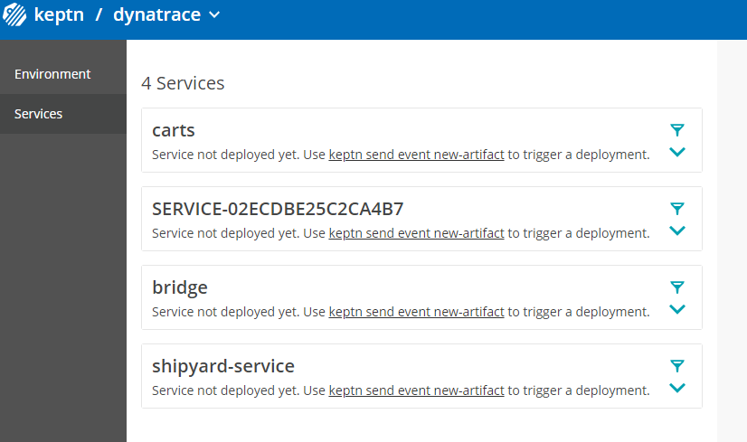

# Dynatrace Service


[](https://travis-ci.org/keptn-contrib/dynatrace-service)
[](https://goreportcard.com/report/github.com/keptn-contrib/dynatrace-service)

The *dynatrace-service* is a [Keptn-service](https://keptn.sh) that forwards Keptn events - occurring during a delivery workflow - to Dynatrace. In addition, the service is responsible for configuring your Dynatrace tenant to fully interact with the Keptn installation.
 
The service is subscribed to the following [Keptn CloudEvents](https://github.com/keptn/spec/blob/master/cloudevents.md):

- sh.keptn.events.deployment-finished
- sh.keptn.events.evaluation-done
- sh.keptn.events.tests-finished
- sh.keptn.internal.event.project.create
- sh.keptn.event.monitoring.configure

## Compatibility Matrix

| Keptn Version    | [Dynatrace Service](https://hub.docker.com/r/keptncontrib/dynatrace-service/tags?page=1&ordering=last_updated) | Kubernetes Versions                      |
|:----------------:|:----------------------------------------:|:----------------------------------------:|
|       0.6.1      | keptn/dynatrace-service:0.6.2            | 1.13 - 1.15                              |
|       0.6.1      | keptncontrib/dynatrace-service:0.6.9     | 1.13 - 1.15                              |
|       0.6.2      | keptncontrib/dynatrace-service:0.7.1     | 1.13 - 1.15                              |
|       0.7.0      | keptncontrib/dynatrace-service:0.8.0     | 1.14 - 1.18                              |
|       0.7.1      | keptncontrib/dynatrace-service:0.9.0     | 1.14 - 1.18                              |

## Installation 

### Deploy in your Kubernetes cluster

**Create a Secret with Credentials:**

1. Create a secret containing the credentials for the Keptn API and Dynatrace Tenant. This includes: `DT_API_TOKEN`, `DT_TENANT`, `KEPTN_API_URL`, `KEPTN_API_TOKEN`, optional is `KEPTN_BRIDGE_URL`.

    * To create a Dynatrace API Token `DT_API_TOKEN`: Log in to your Dynatrace tenant and go to **Settings > Integration > Dynatrace API**. Then, create a new API token with the following permissions:
      - Access problem and event feed, metrics, and topology
      - Read log content
      - Read configuration
      - Write configuration
      - Capture request data


    * The `DT_TENANT` has to be set according to the appropriate pattern:
      - Dynatrace SaaS tenant: `{your-environment-id}.live.dynatrace.com`
      - Dynatrace-managed tenant: `{your-domain}/e/{your-environment-id}`

    * To determine the values for `KEPTN_API_URL` and `KEPTN_API_TOKEN` please refer to the [Keptn docs](https://keptn.sh/docs/0.7.x/operate/install/). 
   
    * If you would like to make use of the inclusion of backlinks to the Keptn Bridge, you can add the `KEPTN_BRIDGE_URL` to the secret. To find the URL of the bridge, please refer to the following section of the [Keptn docs](https://keptn.sh/docs/0.7.x/reference/bridge/#expose-lockdown-bridge).

1. Set the environment variables for: 

    ```console
    DT_API_TOKEN=<DT_API_TOKEN>
    DT_TENANT=<DT_TENANT>
    KEPTN_API_URL=<KEPTN_API_URL>
    KEPTN_API_TOKEN=<KEPTN_API_TOKEN>
    KEPTN_BRIDGE_URL=<KEPTN_BRIDGE_URL> # optional
    ```

1. Create a secret with the credentials by executing the following command:

    ```console
    kubectl -n keptn create secret generic dynatrace
    --from-literal="DT_API_TOKEN=<DT_API_TOKEN>" 
    --from-literal="DT_TENANT=<DT_TENANT>" 
    --from-literal="KEPTN_API_URL=<KEPTN_API_URL>" 
    --from-literal="KEPTN_API_TOKEN=<KEPTN_API_TOKEN>"
    -oyaml --dry-run | kubectl replace -f -
    ```

**Deploy the Service:**
* The `dynatrace-service` supports to automatically generate tagging rules, problem notifications, management zones, dashboards, and custom metric events in your Dynatrace tenant.
 You can configure whether these entities should be generated within your Dynatrace tenant by the environment variables specified in the provided [manifest](https://raw.githubusercontent.com/keptn-contrib/dynatrace-service/$VERSION/deploy/service.yaml),
 i.e., using the environment variables `GENERATE_TAGGING_RULES` (default `true`), `GENERATE_PROBLEM_NOTIFICATIONS` (default `true`), `GENERATE_MANAGEMENT_ZONES` (default `true`), `GENERATE_DASHBOARDS` (default `true`), `GENERATE_METRIC_EVENTS` (default `true`), and `SYNCHRONIZE_DYNATRACE_SERVICES` (default `true`).
 
* The `dynatrace-service` by default validates the SSL certificate of the Dynatrace API.
If your Dynatrace API only has a self-signed certificate, you can disable the SSL certificate check
by setting the environment variable `HTTP_SSL_VERIFY` (default `true`) specified in the [manifest](https://raw.githubusercontent.com/keptn-contrib/dynatrace-service/$VERSION/deploy/service.yaml) to `false`.


* Deploy the `dynatrace-service` using `kubectl apply`:

    ```console
    kubectl apply -f https://raw.githubusercontent.com/keptn-contrib/dynatrace-service/$VERSION/deploy/service.yaml -n keptn
    ```
   
   **Note**: Replace `$VERSION` with the desired version number (e.g., 0.8.0) you want to install.
   
   This installs the `dynatrace-service` in the `keptn` namespace, which you can verify using:

   ```console
   kubectl -n keptn get deployment dynatrace-service -o wide
   kubectl -n keptn get pods -l run=dynatrace-service
   ```

* When an event is sent out by Keptn, you see an event in Dynatrace for the correlating service:


### Up- or Downgrading

Adapt and use the following command in case you want to up- or downgrade your installed version (specified by the `$VERSION` placeholder):

```console
kubectl -n keptn set image deployment/dynatrace-service dynatrace-service=keptncontrib/dynatrace-service:$VERSION --record
```

### Uninstall

To uninstall the dynatrace service and remove the subscriptions to Keptn channels execute this command.

```console
kubectl delete -f https://raw.githubusercontent.com/keptn-contrib/dynatrace-service/$VERSION/deploy/service.yaml -n keptn
```
   
**Note**: Replace `$VERSION` with the desired version number (e.g., 0.8.0) you want to install.


## Set up Dynatrace monitoring for already existing Keptn projects

If you already have created a project using Keptn and would like to enable Dynatrace monitoring for that project afterwards, please execute the following command:

```console
keptn configure monitoring dynatrace --project=<PROJECT_NAME>
```

**ATTENTION:** If you have different Dynatrace Tenants (or Managed Environments) and want to make sure a Keptn project is linked to the correct Dynatrace Tenant/Environment please have a look at the dynatrace.conf.yaml file option as explained further down in this readme. It allows you on a project level to specify which Dynatrace Tenant/Environment to use. Whats needed is that you first upload dynatrace.conf.yaml on project level before calling keptn configure monitoring!

## Usage Information

### Sending Events to Dynatrace Monitored Entities

By default, the *dynatrace-service* assumes that all events it sends to Dynatrace, e.g: Deployment or Test Start/Stop Events are sent to a monitored Dynatrace SERVICE entity that has the following attachRule definition:
```
attachRules:
  tagRule:
    meTypes:
    - SERVICE
    tags:
    - context: CONTEXTLESS
      key: keptn_project
      value: $PROJECT
    - context: CONTEXTLESS
      key: keptn_service
      value: $SERVICE
    - context: CONTEXTLESS
      key: keptn_stage
      value: $STAGE
```

If your services are deployed with Keptn's *helm-service*, chances are that your services are automatically tagged like this. Here is a screenshot of how these tags show up in Dynatrace for a service deployed with Keptn:


If your services are however not tagged with these but other tags - or if you want the *dynatrace-service* to send the events not to a service but rather an application, process group or host then you can overwrite the default behavior by providing a *dynatrace/dynatrace.conf.yaml* file. This file can either be located on project, stage or service level. This file allows you to define your own attachRules and also allows you to leverage all available $PLACEHOLDERS such as $SERVICE,$STAGE,$PROJECT,$LABEL.YOURLABEL, etc. - here is one example: It will instruct the *dynatrace-service* to send its events to a monitored Dynatrace Service that holds a tag with the key that matches your Keptn Service name ($SERVICE) as well as holds an additional auto-tag that defines the enviornment to be pulled from a label that has been sent to Keptn.
```
---
spec_version: '0.1.0'
attachRules:
  tagRule:
    meTypes:
    - SERVICE
    tags:
    - context: CONTEXTLESS
      key: $SERVICE
    - context: CONTEXTLESS
      key: environment
      value: $LABEL.environment
```

Now - once you have this file - make sure you add it as a resource to your Keptn Project. As mentioned above - the dynatrace/dynatrace.conf.yaml can be uploaded either on project, service or stage level. Here is an example on how to define it for the whole project!
```
keptn add-resource --project=yourproject --resource=dynatrace/dynatrace.conf.yaml --resourceUri=dynatrace/dynatrace.conf.yaml
```

### Enriching Events sent to Dynatrace with more context

The *dynatrace-service* sends CUSTOM_DEPLOYMENT, CUSTOM_INFO and CUSTOM_ANNOTATION events when it handles Keptn events such as deployment-finished, test-finished or evaluation-done. The *dynatrace-service* will parse all labels in the Keptn event and will pass them on to Dynatrace as custom properties. This gives you more flexiblity in passing more context to Dynatrace, e.g: ciBackLink for a CUSTOM_DEPLOYMENT or things like Jenkins Job ID, Jenkins Job URL, etc. that will show up in Dynatrace as well. 

Here is a sample Deployment Finished Event:
```
{
  "type": "sh.keptn.events.deployment-finished",
  "contenttype": "application/json",
  "specversion": "0.2",
  "source": "jenkins",
  "id": "f2b878d3-03c0-4e8f-bc3f-454bc1b3d79d",
  "shkeptncontext": "08735340-6f9e-4b32-97ff-3b6c292bc509",
  "data": {
    "project": "simpleproject",
    "stage": "staging",
    "service": "simplenode",
    "testStrategy": "performance",
    "deploymentStrategy": "direct",
    "tag": "0.10.1",
    "image": "grabnerandi/simplenodeservice:1.0.0",
    "labels": {
      "testid": "12345",
      "buildnr": "build17",
      "runby": "grabnerandi",
      "environment" : "testenvironment",
      "ciBackLink" : "http://myjenkinsserver/job/12345"
    },
    "deploymentURILocal": "http://carts.sockshop-staging.svc.cluster.local",
    "deploymentURIPublic":  "https://carts.sockshop-staging.my-domain.com"
  }
}
```

It will result in the following events in Dynatrace:


### Sending Events to different Dynatrace Environments per Project, Stage or Service

Many Dynatrace user have different Dynatrace environments for e.g: Pre-Production vs Production. By default the *dynatrace-service* gets the Dynatrace Tenant URL & Token from the k8s secret stored in keptn/dynatrace (see installation instructions for details).
If you have multiple Dynatrace environment and want to have the *dynatrace-service* send events to a specific Dynatrace Environment for a specific Keptn Project, Stage or Service you can now specify the name of the secret that should be used in the *dynatrace.conf.yaml* which was introduced earlier. Here is a sample file:
```
---
spec_version: '0.1.0'
dtCreds: dynatrace-production
attachRules:
  tagRule:
    meTypes:
    - SERVICE
    tags:
    - context: CONTEXTLESS
      key: $SERVICE
    - context: CONTEXTLESS
      key: environment
      value: $LABEL.environment
```

The *dtCreds* value references your k8s secret where you store your Tenant and Token information. If you do not specify dtCreds it defaults to *dynatrace* which means it is the default behavior that we had for this service since the beginning!

As a reminder - here is the way how to upload this to your Keptn Configuration Repository. In case you have two separate dynatrace.conf.yaml for your different dynatrace tenants you can even upload them to your different stages in your Keptn project in case your different stages are monitored by different dynatrace enviornments. Here are some examples on how to upload these files:
```
keptn add-resource --project=yourproject --stage=preprod --resource=dynatrace/dynatrace-preprod.conf.yaml --resourceUri=dynatrace/dynatrace.conf.yaml
keptn add-resource --project=yourproject --stage=production --resource=dynatrace/dynatrace-production.conf.yaml --resourceUri=dynatrace/dynatrace.conf.yaml
```


### Synchronizing Service Entities detected by Dynatrace

The Dynatrace service allows to automatically import Service Entities detected by Dynatrace into Keptn. To enable this feature, the environment variable `SYNCHRONIZE_DYNATRACE_SERVICES`
needs to be set to `true`. By default, the service will scan Dynatrace for Service Entities every 300s. This interval can be configured by setting the environment variable `SYNCHRONIZE_DYNATRACE_SERVICES_INTERVAL_SECONDS` to the desired value.

To import a Service Entity into Keptn, a project with the name `dynatrace`, containing the stage `quality-gate` has to be available within Keptn. To create the project, create a `shipyard.yaml` file with the following content:

```
stages:
  - name: "quality-gate"
    test_strategy: "performance"
```

Afterwards, create the project using the following command:

```
keptn create project dynatrace --shipyard=shipyard.yaml
```

After the project has been created, you can import Service Entities detected by Dynatrace by applying the tags `keptn_managed` and `keptn_service: <service_name>`:


 
The Dynatrace Service will then periodically check for services containing those tags and create correlating services within the `dynatrace` project in Keptn.
If the value of `service_name` is not set to a valid Keptn service name, the Service Entity ID will be used as a fallback value for the Keptn service name.
After the service synchronization, you should be able to see the newly created services within the Bridge:




Note that if you would like to remove one of the imported services from Keptn, you will need to use the Keptn CLI to delete the service after removing the `keptn_managed` and `keptn_service` tags:

```
keptn delete service <service-to-be-removed> --project=dynatrace
```

In addition to creating the service, the dynatrace-service will also upload the following default `slo.yaml` to enable the quality-gates feature for the service:

```
---
spec_version: "1.0"
comparison:
  aggregate_function: "avg"
  compare_with: "single_result"
  include_result_with_score: "pass"
  number_of_comparison_results: 1
filter:
objectives:
  - sli: "response_time_p95"
    key_sli: false
    pass:             
      - criteria:
          - "<600"    
    warning:        
      - criteria:
          - "<=800"
    weight: 1
  - sli: "error_rate"
    key_sli: false
    pass:
      - criteria:
          - "<5"
  - sli: throughput
total_score:
  pass: "90%"
  warning: "75%"
```
