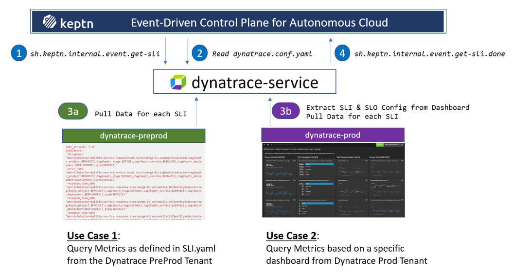
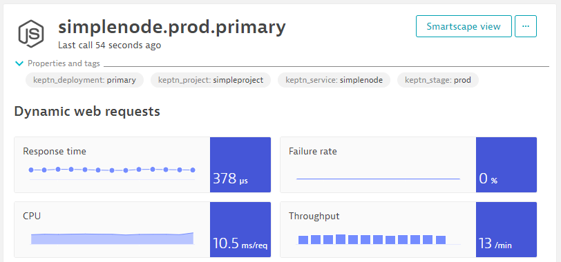

# Dynatrace Service


[](https://travis-ci.org/keptn-contrib/dynatrace-service)
[](https://goreportcard.com/report/github.com/keptn-contrib/dynatrace-service)

The *dynatrace-service* is a [Keptn-service](https://keptn.sh) that forwards Keptn events - occurring during a delivery workflow - to Dynatrace. In addition, the service is responsible for configuring your Dynatrace tenant to fully interact with the Keptn installation.
 
The service is subscribed to the following [Keptn CloudEvents](https://github.com/keptn/spec/blob/master/cloudevents.md):

- sh.keptn.events.deployment-finished
- sh.keptn.events.evaluation-done
- sh.keptn.events.tests-finished
- sh.keptn.internal.event.project.create
- sh.keptn.event.monitoring.configure
- sh.keptn.event.get-sli.triggered

The *dynatrace-service* is a [Keptn](https://keptn.sh) service that is responsible for retrieving the values of SLIs from your Dynatrace Tenant via the Dynatrace Metrics v2 API endpoint. For that it handles the Keptn Event *sh.keptn.internal.event.get-sli* which gets sent as part of a quality gate evaluation!

The *dynatrace-service* provides the capabilty to connect to different Dynatrace Tenants for your Keptn projects, stages or services. It also allows you to either define SLIs through `sli.yaml` files or through a Dynatrace dashboard and all of this is configurable through `dynatrace.conf.yaml`:



By default, even if you do not specify a custom `sli.yaml` or a Dynatrace dashboard, the following SLIs are automatically supported in case you reference them in your `slo.yaml`:

```yaml
 - throughput: builtin:service.requestCount.total
 - error_rate: builtin:service.errors.total.rate
 - response_time_p50: builtin:service.response.time:percentile(50)
 - response_time_p90: builtin:service.response.time:percentile(90)
 - response_time_p95: builtin:service.response.time:percentile(95)
```

By default these metrics (SLIs) are queried from a Dynatrace-monitored service entity with the tags `keptn_project`, `keptn_service`, `keptn_stage` & `keptn_deployment`.


As highlighted above, the *dynatrace-service* also provides the following capabilities:

* Connecting to different Dynatrace Tenants (SaaS or Managed) depending on Keptn Project, Stage or Service

* Defining a custom list of SLIs based on the Dynatrace Metrics API v2. This allows SLIs to reference any metric in Dynatrace: Application, Service, Process Groups, Host, Custom Devices, Calculated Service Metrics, External Metrics ...

* Visually defining SLIs & SLOs through a Dynatrace Dashboard instead of `sli.yaml` and `slo.yaml`

## Compatibility Matrix

| Keptn Version    | [Dynatrace Service](https://hub.docker.com/r/keptncontrib/dynatrace-service/tags?page=1&ordering=last_updated) | Kubernetes Versions                      |
|:----------------:|:----------------------------------------:|:----------------------------------------:|
|       0.6.1      | keptn/dynatrace-service:0.6.2            | 1.13 - 1.15                              |
|       0.6.1      | keptncontrib/dynatrace-service:0.6.9     | 1.13 - 1.15                              |
|       0.6.2      | keptncontrib/dynatrace-service:0.7.1     | 1.13 - 1.15                              |
|       0.7.0      | keptncontrib/dynatrace-service:0.8.0     | 1.14 - 1.18                              |
|       0.7.1      | keptncontrib/dynatrace-service:0.9.0     | 1.14 - 1.18                              |
|       0.7.2      | keptncontrib/dynatrace-service:0.10.0     | 1.14 - 1.18                             |
|       0.7.3      | keptncontrib/dynatrace-service:0.10.1     | 1.14 - 1.18                            |
|       0.7.3      | keptncontrib/dynatrace-service:0.10.2     | 1.14 - 1.18                            |
|       0.7.3      | keptncontrib/dynatrace-service:0.10.3     | 1.14 - 1.18                            |
|       0.8.0, 0.8.1      | keptncontrib/dynatrace-service:0.11.0 (*)    | 1.14 - 1.19                            |
|       0.8.0, 0.8.1      | keptncontrib/dynatrace-service:0.12.0    | 1.14 - 1.19                            |
|       0.8.0 - 0.8.3     | keptncontrib/dynatrace-service:0.13.1    | 1.14 - 1.19                            |
|       0.8.0 - 0.8.3     | keptncontrib/dynatrace-service:0.14.0    | 1.14 - 1.19                            |
|       0.8.4 - 0.8.6     | keptncontrib/dynatrace-service:0.15.0    | 1.15 - 1.20                        |
|       0.8.4 - 0.8.6     | keptncontrib/dynatrace-service:0.15.1    | 1.15 - 1.20                        |
|       0.8.4 - 0.8.7     | keptncontrib/dynatrace-service:0.16.0    | 1.15 - 1.20                        |

(*) *Note:* 0.11.0 is feature-complete with 0.10.0. Changes and fixes made from 0.10.1 to 0.10.3 will be incorporated in 0.12.0

## Overview
- [Installation](./documentation/installation.md)
- [Configuration](./documentation/configuration.md)
- [SLI and SLO configuration](./documentation/sli-configuration.md)
- [Development](./documentation/development.md)


