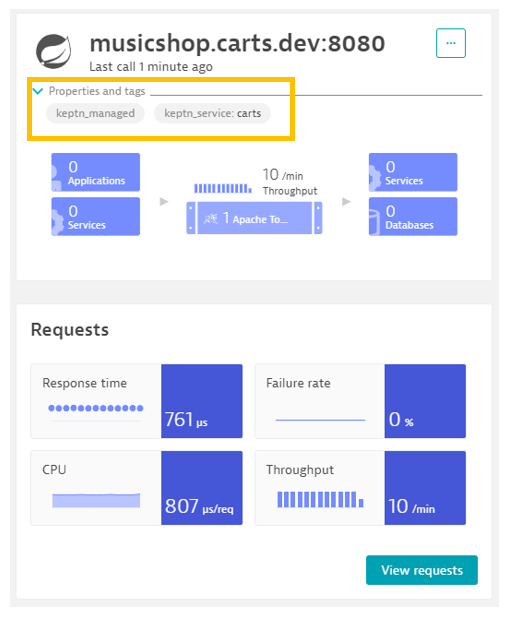

# Configuration

## Sending Events to Dynatrace Monitored Entities

By default, the *dynatrace-service* assumes that all events it sends to Dynatrace, e.g. Deployment or Test Start/Stop Events, are sent to a monitored Dynatrace Service entity that has the following attachRule definition:

```yaml
attachRules:
  tagRule:
  - meTypes:
    - SERVICE
    tags:
    - context: CONTEXTLESS
      key: keptn_project
      value: $PROJECT
    - context: CONTEXTLESS
      key: keptn_service
      value: $SERVICE
    - context: CONTEXTLESS
      key: keptn_stage
      value: $STAGE
```

If your services are deployed with Keptn's *helm-service*, chances are that your services are automatically tagged like this. Here is a screenshot of how these tags show up in Dynatrace for a service deployed with Keptn:


If your services are however not tagged with these but other tags or if you want the *dynatrace-service* to send the events not to a service but rather an application, process group or host then you can overwrite the default behavior by providing a `dynatrace.conf.yaml` file. This file can either be located on project, stage or service level. This file allows you to define your own attachRules and also allows you to leverage placeholders such as `$SERVICE`, `$STAGE`, `$PROJECT`, `$LABEL.YOURLABEL` etc. 

The following example instructs the *dynatrace-service* to send its events to a monitored Dynatrace Service that holds a tag with the key that matches your Keptn Service name (`$SERVICE`) as well as holds an additional auto-tag that defines the environment to be pulled from a label that has been sent to Keptn:

```yaml
---
spec_version: '0.1.0'
attachRules:
  tagRule:
  - meTypes:
    - SERVICE
    tags:
    - context: CONTEXTLESS
      key: $SERVICE
    - context: CONTEXTLESS
      key: environment
      value: $LABEL.environment
```

Now - once you have this file - make sure you add it as a resource to your Keptn Project. As mentioned above - the `dynatrace.conf.yaml` can be uploaded either on project, service or stage level. Here is an example on how to define it for the whole project:

```console
keptn add-resource --project=yourproject --resource=dynatrace/dynatrace.conf.yaml --resourceUri=dynatrace/dynatrace.conf.yaml
```

## Enriching Events sent to Dynatrace with more context

The *dynatrace-service* sends CUSTOM_DEPLOYMENT, CUSTOM_INFO and CUSTOM_ANNOTATION events when it handles Keptn events such as deployment-finished, test-finished or evaluation-done. The *dynatrace-service* will parse all labels in the Keptn event and will pass them on to Dynatrace as custom properties. This gives you more flexiblity in passing more context to Dynatrace, e.g: ciBackLink for a CUSTOM_DEPLOYMENT or things like Jenkins Job ID, Jenkins Job URL, etc. that will show up in Dynatrace as well. 

Here is a sample Deployment Finished Event:
```json
{
  "type": "sh.keptn.events.deployment-finished",
  "contenttype": "application/json",
  "specversion": "0.2",
  "source": "jenkins",
  "id": "f2b878d3-03c0-4e8f-bc3f-454bc1b3d79d",
  "shkeptncontext": "08735340-6f9e-4b32-97ff-3b6c292bc509",
  "data": {
    "project": "simpleproject",
    "stage": "staging",
    "service": "simplenode",
    "testStrategy": "performance",
    "deploymentStrategy": "direct",
    "tag": "0.10.1",
    "image": "grabnerandi/simplenodeservice:1.0.0",
    "labels": {
      "testid": "12345",
      "buildnr": "build17",
      "runby": "grabnerandi",
      "environment" : "testenvironment",
      "ciBackLink" : "http://myjenkinsserver/job/12345"
    },
    "deploymentURILocal": "http://carts.sockshop-staging.svc.cluster.local",
    "deploymentURIPublic":  "https://carts.sockshop-staging.my-domain.com"
  }
}
```

It will result in the following events in Dynatrace:


## Sending Events to different Dynatrace Environments per Project, Stage or Service

Many Dynatrace user have different Dynatrace environments for pre-production and production. By default the *dynatrace-service* gets the Dynatrace Tenant URL and Token from the `dynatrace` Kubernetes secret (see installation instructions for details).

If you have multiple Dynatrace environments and want to have the *dynatrace-service* send events to a specific Dynatrace Environment for a specific Keptn Project, Stage or Service you can specify the name of the secret that should be used in the `dynatrace.conf.yaml` which was introduced earlier. Here is a sample file:

```yaml
---
spec_version: '0.1.0'
dtCreds: dynatrace-production
attachRules:
  tagRule:
  - meTypes:
    - SERVICE
    tags:
    - context: CONTEXTLESS
      key: $SERVICE
    - context: CONTEXTLESS
      key: environment
      value: $LABEL.environment
```

The `dtCreds` value references your Kubernetes secret where you store your Dynatrace tenant and API token information. If you do not specify `dtCreds` it defaults to `dynatrace` which means it is the default behavior that we had for this service since the beginning!

As a reminder - here is the way how to upload this to your Keptn Configuration Repository. In case you have two separate `dynatrace.conf.yaml` for your different Dynatrace tenants you can even upload them to your different stages in your Keptn project in case your different stages are monitored by different Dynatrace enviornments, e.g.:

```console
keptn add-resource --project=yourproject --stage=preprod --resource=dynatrace/dynatrace-preprod.conf.yaml --resourceUri=dynatrace/dynatrace.conf.yaml

keptn add-resource --project=yourproject --stage=production --resource=dynatrace/dynatrace-production.conf.yaml --resourceUri=dynatrace/dynatrace.conf.yaml
```

## Synchronizing Service Entities detected by Dynatrace

The *dynatrace-service* allows Service Entities detected by Dynatrace to be automatically imported into Keptn. To enable this feature, the environment variable `SYNCHRONIZE_DYNATRACE_SERVICES`
needs to be set to `true`. Once enabled, the service will by default scan Dynatrace for Service Entities every 60 seconds. This interval can be configured by changing the environment variable `SYNCHRONIZE_DYNATRACE_SERVICES_INTERVAL_SECONDS`.

To import a Service Entity into Keptn, a project with the name `dynatrace`, containing the stage `quality-gate` has to be available within Keptn. To create the project, create a `shipyard.yaml` file with the following content:

```yaml
apiVersion: "spec.keptn.sh/0.2.2"
kind: "Shipyard"
metadata:
  name: "dynatrace"
spec:
  stages:
    - name: "quality-gate"
      test_strategy: "performance"
```

Afterwards, create the project using the following command:

```console
keptn create project dynatrace --shipyard=shipyard.yaml
```

After the project has been created, you can import Service Entities detected by Dynatrace by applying the tags `keptn_managed` and `keptn_service: <service_name>`:



To set the `keptn_managed` tag, you can use the Dynatrace UI: First, in the **Transactions and services** menu, open the Service Entity you would like to tag, and add the `keptn_managed` tag as shown in the screenshot below:


 
The `keptn_service` tag can be set in two ways: 

1. Using an automated tagging rule, which can be set up in the menu **Settings > Tags > Automatically applied tags**. Within this section, add a new rule with the settings shown below:

    

1. Sending a POST API call to the `v2/tags` endpoint ([as described here](https://www.dynatrace.com/support/help/dynatrace-api/environment-api/custom-tags/post-tags/)):
    ```console
    curl -X POST "${DYNATRACE_TENANT}/api/v2/tags?entitySelector=${ENTITY_ID}" -H "accept: application/json; charset=utf-8" -H "Authorization: Api-Token ${API_TOKEN}" -H "Content-Type: application/json; charset=utf-8" -d "{\"tags\":[{\"key\":\"keptn_service\",\"value\":\"test\"}]}"
    ```

The *dynatrace-service* will then periodically check for services containing those tags and create correlating services within the `dynatrace` project in Keptn. After the service synchronization, you should be able to see the newly created services within the Bridge:


Note that if you would like to remove one of the imported services from Keptn, you will need to use the Keptn CLI to delete the service after removing the `keptn_managed` and `keptn_service` tags:

```console
keptn delete service <service-to-be-removed> --project=dynatrace
```

In addition to creating the service, the *dynatrace-service* will also upload the following default `slo.yaml` to enable the quality-gates feature for the service:

```yaml
---
spec_version: "1.0"
comparison:
  aggregate_function: "avg"
  compare_with: "single_result"
  include_result_with_score: "pass"
  number_of_comparison_results: 1
filter:
objectives:
  - sli: "response_time_p95"
    key_sli: false
    pass:             
      - criteria:
          - "<600"    
    warning:        
      - criteria:
          - "<=800"
    weight: 1
  - sli: "error_rate"
    key_sli: false
    pass:
      - criteria:
          - "<5"
  - sli: throughput
total_score:
  pass: "90%"
  warning: "75%"
```

To enable queries against the SLIs specified in the `SLO.yaml` file, the following configuration is created for the SLI configuration for the *dynatrace-service*:

```yaml
---
spec_version: '1.0'
indicators:
  throughput: "metricSelector=builtin:service.requestCount.total:merge(\"dt.entity.service\"):sum&entitySelector=type(SERVICE),tag(keptn_managed),tag(keptn_service:$SERVICE)"
  error_rate: "metricSelector=builtin:service.errors.total.rate:merge(\"dt.entity.service\"):avg&entitySelector=type(SERVICE),tag(keptn_managed),tag(keptn_service:$SERVICE)"
  response_time_p50: "metricSelector=builtin:service.response.time:merge(\"dt.entity.service\"):percentile(50)&entitySelector=type(SERVICE),tag(keptn_managed),tag(keptn_service:$SERVICE)"
  response_time_p90: "metricSelector=builtin:service.response.time:merge(\"dt.entity.service\"):percentile(90)&entitySelector=type(SERVICE),tag(keptn_managed),tag(keptn_service:$SERVICE)"
  response_time_p95: "metricSelector=builtin:service.response.time:merge(\"dt.entity.service\"):percentile(95)&entitySelector=type(SERVICE),tag(keptn_managed),tag(keptn_service:$SERVICE)"`
```

This file will be stored in the `dynatrace/sli.yaml` config file for the created service.

## Sending Dynatrace Problems to Keptn for Auto-Remediation

One major use case of Keptn is Auto-Remediation. This is where Keptn receives a problem event which then triggers a remediation workflow.

External tools such as Dynatrace can send a `sh.keptn.events.problem` event to Keptn but first need to be mapped to a Keptn Project, Service and Stage. Depending on the alerting tool this might be done differently. 

The *dynatrace-service* provides the capabilty to receive such a `sh.keptn.events.problem` - analyzes its content and sends a `sh.keptn.event.problem.open` to the matching keptn project, service and stage including all relevent problem details such as PID, ProblemTitle, Problem URL, ...

**Setting Up Problem Notification for Problems detected on Keptn Deployed Services**

If you use Keptn to deploy your microservices and follow our tagging practices, Dynatrace will tag your monitored services with `keptn_project`, `keptn_service` and `keptn_stage`. If Dynatrace then detects a problem in one of these deployed services, e.g: High Failure Rate, Slow response time, ... you can let Dynatrace send these problems back to Keptn and map the problem directly to the correct Kept Project, Stage and Service.

To setup this integration you just need to setup a Custom Problem Notification that looks like this: 

```json
{
    "specversion":"1.0",
    "shkeptncontext":"{PID}",
    "type":"sh.keptn.events.problem",
    "source":"dynatrace",
    "id":"{PID}",
    "time":"",
    "contenttype":"application/json",
    "data": {
        "State":"{State}",
        "ProblemID":"{ProblemID}",
        "PID":"{PID}",
        "ProblemTitle":"{ProblemTitle}",
        "ProblemURL":"{ProblemURL}",
        "ProblemDetails":{ProblemDetailsJSON},
        "Tags":"{Tags}",
        "ImpactedEntities":{ImpactedEntities},
        "ImpactedEntity":"{ImpactedEntity}",
    }
}
```

The *dynatrace-service* will parse the `Tags` field and tries to find `keptn_project`, `keptn_service` and `keptn_stage` tags that come directly from the impacted entities that Dynatrace detected. If the problem was in fact detected on a Keptn deployed service the `{Tags}` string should contain the correct information and the mapping will work.

*Best practice:* if you setup this type of integration we suggest that you use a Dynatrace Alerting Profile that only includes problems on services that have the Keptn tags. Otherwise problems will be sent to Keptn that can't be mapped through this capability!


**Setting Up Problem Notification for ANY type of detected problem, e.g. Infrastructure**

So - what if you want to send any type of problem for a specific Alerting Profile to Keptn and use Keptn to orchestrate auto-remediation workflows? In that case we allow you to specify the Keptn Project, Stage and Service as properties in the data structure that is sent to Keptn.

Here the custom payload for a Custom Notification Integration that will send all problems to a Keptn project called `dynatrace`, stage called `production` and service called `allproblems`:

```json
{
    "specversion":"1.0",
    "shkeptncontext":"{PID}",
    "type":"sh.keptn.events.problem",
    "source":"dynatrace",
    "id":"{PID}",
    "time":"",
    "contenttype":"application/json",
    "data": {
        "State":"{State}",
        "ProblemID":"{ProblemID}",
        "PID":"{PID}",
        "ProblemTitle":"{ProblemTitle}",
        "ProblemURL":"{ProblemURL}",
        "ProblemDetails":{ProblemDetailsJSON},
        "Tags":"{Tags}",
        "ImpactedEntities":{ImpactedEntities},
        "ImpactedEntity":"{ImpactedEntity}",
        "KeptnProject" : "demo-remediation",
        "KeptnService" : "allproblem",
        "KeptnStage" : "production"
    }
}
``` 

When the *dynatrace-service* receives this `sh.keptn.events.problem` it will parse the fields `KeptnProject`, `KeptnService` and `KeptnStage` and will then send a `sh.keptn.event.problem.open` to Keptn including the rest of the problem details! This allows you to send any type of Dynatrace detected problem to Keptn and let Keptn execute a remediation workflow.

*Best Practice:* We suggest that you use Dynatrace Alerting Profiles to filter on certain problem types, e.g: Infrastructure problems in production, Slow Performance in Developer Environment ...  We then also suggest that you create a Keptn project on Dynatrace to handle these remediation workflows and create a Keptn Service for each alerting profile. With this you have a clear match of Problems per Alerting Profile and a Keptn Remediation Workflow that will be executed as it matches your Keptn Project and Service. For stage I suggest you also go with the environment names you have, e.g. Pre-Prod or Production.

Here is a screenshot of a workflow triggered by a Dynatrace problem and how it then executes in Keptn:


