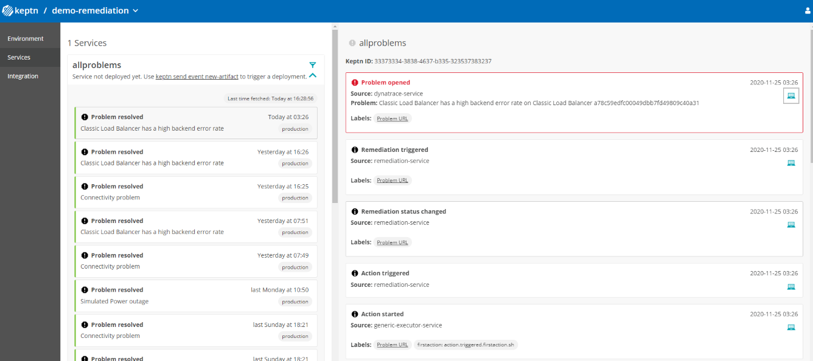

## Sending Dynatrace Problems to Keptn for Auto-Remediation

One major use case of Keptn is Auto-Remediation. This is where Keptn receives a problem event which then triggers a remediation workflow.

External tools such as Dynatrace can send a `sh.keptn.events.problem` event to Keptn but first need to be mapped to a Keptn Project, Service and Stage. Depending on the alerting tool this might be done differently. 

The *dynatrace-service* provides the capabilty to receive such a `sh.keptn.events.problem` - analyzes its content and sends a `sh.keptn.event.problem.open` to the matching keptn project, service and stage including all relevent problem details such as PID, ProblemTitle, Problem URL, ...

**Setting Up Problem Notification for Problems detected on Keptn Deployed Services**

If you use Keptn to deploy your microservices and follow our tagging practices, Dynatrace will tag your monitored services with `keptn_project`, `keptn_service` and `keptn_stage`. If Dynatrace then detects a problem in one of these deployed services, e.g: High Failure Rate, Slow response time, ... you can let Dynatrace send these problems back to Keptn and map the problem directly to the correct Kept Project, Stage and Service.

To setup this integration you just need to setup a Custom Problem Notification that looks like this: 

```json
{
    "specversion":"1.0",
    "shkeptncontext":"{PID}",
    "type":"sh.keptn.events.problem",
    "source":"dynatrace",
    "id":"{PID}",
    "time":"",
    "contenttype":"application/json",
    "data": {
        "State":"{State}",
        "ProblemID":"{ProblemID}",
        "PID":"{PID}",
        "ProblemTitle":"{ProblemTitle}",
        "ProblemURL":"{ProblemURL}",
        "ProblemDetails":{ProblemDetailsJSON},
        "Tags":"{Tags}",
        "ImpactedEntities":{ImpactedEntities},
        "ImpactedEntity":"{ImpactedEntity}",
    }
}
```

The *dynatrace-service* will parse the `Tags` field and tries to find `keptn_project`, `keptn_service` and `keptn_stage` tags that come directly from the impacted entities that Dynatrace detected. If the problem was in fact detected on a Keptn deployed service the `{Tags}` string should contain the correct information and the mapping will work.

*Best practice:* if you setup this type of integration we suggest that you use a Dynatrace Alerting Profile that only includes problems on services that have the Keptn tags. Otherwise problems will be sent to Keptn that can't be mapped through this capability!


**Setting Up Problem Notification for ANY type of detected problem, e.g. Infrastructure**

So - what if you want to send any type of problem for a specific Alerting Profile to Keptn and use Keptn to orchestrate auto-remediation workflows? In that case we allow you to specify the Keptn Project, Stage and Service as properties in the data structure that is sent to Keptn.

Here the custom payload for a Custom Notification Integration that will send all problems to a Keptn project called `dynatrace`, stage called `production` and service called `allproblems`:

```json
{
    "specversion":"1.0",
    "shkeptncontext":"{PID}",
    "type":"sh.keptn.events.problem",
    "source":"dynatrace",
    "id":"{PID}",
    "time":"",
    "contenttype":"application/json",
    "data": {
        "State":"{State}",
        "ProblemID":"{ProblemID}",
        "PID":"{PID}",
        "ProblemTitle":"{ProblemTitle}",
        "ProblemURL":"{ProblemURL}",
        "ProblemDetails":{ProblemDetailsJSON},
        "Tags":"{Tags}",
        "ImpactedEntities":{ImpactedEntities},
        "ImpactedEntity":"{ImpactedEntity}",
        "KeptnProject" : "demo-remediation",
        "KeptnService" : "allproblem",
        "KeptnStage" : "production"
    }
}
``` 

When the *dynatrace-service* receives this `sh.keptn.events.problem` it will parse the fields `KeptnProject`, `KeptnService` and `KeptnStage` and will then send a `sh.keptn.event.problem.open` to Keptn including the rest of the problem details! This allows you to send any type of Dynatrace detected problem to Keptn and let Keptn execute a remediation workflow.

*Best Practice:* We suggest that you use Dynatrace Alerting Profiles to filter on certain problem types, e.g: Infrastructure problems in production, Slow Performance in Developer Environment ...  We then also suggest that you create a Keptn project on Dynatrace to handle these remediation workflows and create a Keptn Service for each alerting profile. With this you have a clear match of Problems per Alerting Profile and a Keptn Remediation Workflow that will be executed as it matches your Keptn Project and Service. For stage I suggest you also go with the environment names you have, e.g. Pre-Prod or Production.

Here is a screenshot of a workflow triggered by a Dynatrace problem and how it then executes in Keptn:


