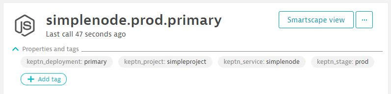
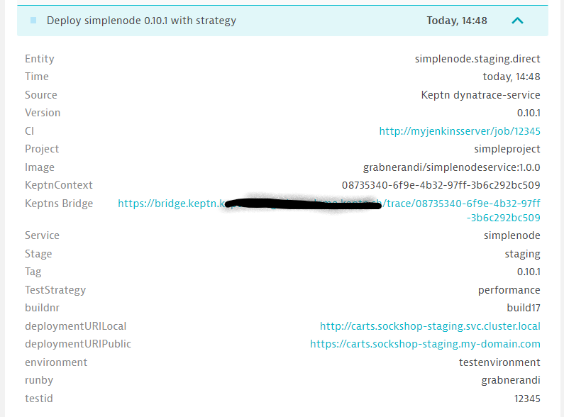

## Sending Events to Dynatrace Monitored Entities

By default, the *dynatrace-service* assumes that all events it sends to Dynatrace, e.g. Deployment or Test Start/Stop Events, are sent to a monitored Dynatrace Service entity that has the following attachRule definition:

```yaml
attachRules:
  tagRule:
  - meTypes:
    - SERVICE
    tags:
    - context: CONTEXTLESS
      key: keptn_project
      value: $PROJECT
    - context: CONTEXTLESS
      key: keptn_service
      value: $SERVICE
    - context: CONTEXTLESS
      key: keptn_stage
      value: $STAGE
```

If your services are deployed with Keptn's *helm-service*, chances are that your services are automatically tagged like this. Here is a screenshot of how these tags show up in Dynatrace for a service deployed with Keptn:



If your services are however not tagged with these but other tags or if you want the *dynatrace-service* to send the events not to a service but rather an application, process group or host then you can overwrite the default behavior by providing a `dynatrace.conf.yaml` file. This file can either be located on project, stage or service level. This file allows you to define your own attachRules and also allows you to leverage placeholders such as `$SERVICE`, `$STAGE`, `$PROJECT`, `$LABEL.YOURLABEL` etc. 

The following example instructs the *dynatrace-service* to send its events to a monitored Dynatrace Service that holds a tag with the key that matches your Keptn Service name (`$SERVICE`) as well as holds an additional auto-tag that defines the environment to be pulled from a label that has been sent to Keptn:

```yaml
---
spec_version: '0.1.0'
attachRules:
  tagRule:
  - meTypes:
    - SERVICE
    tags:
    - context: CONTEXTLESS
      key: $SERVICE
    - context: CONTEXTLESS
      key: environment
      value: $LABEL.environment
```

Now - once you have this file - make sure you add it as a resource to your Keptn Project. As mentioned above - the `dynatrace.conf.yaml` can be uploaded either on project, service or stage level. Here is an example on how to define it for the whole project:

```console
keptn add-resource --project=yourproject --resource=dynatrace/dynatrace.conf.yaml --resourceUri=dynatrace/dynatrace.conf.yaml
```

## Enriching Events sent to Dynatrace with more context

The *dynatrace-service* sends CUSTOM_DEPLOYMENT, CUSTOM_INFO and CUSTOM_ANNOTATION events when it handles Keptn events such as deployment-finished, test-finished or evaluation-done. The *dynatrace-service* will parse all labels in the Keptn event and will pass them on to Dynatrace as custom properties. This gives you more flexiblity in passing more context to Dynatrace, e.g: ciBackLink for a CUSTOM_DEPLOYMENT or things like Jenkins Job ID, Jenkins Job URL, etc. that will show up in Dynatrace as well. 

Here is a sample Deployment Finished Event:
```json
{
  "type": "sh.keptn.events.deployment-finished",
  "contenttype": "application/json",
  "specversion": "0.2",
  "source": "jenkins",
  "id": "f2b878d3-03c0-4e8f-bc3f-454bc1b3d79d",
  "shkeptncontext": "08735340-6f9e-4b32-97ff-3b6c292bc509",
  "data": {
    "project": "simpleproject",
    "stage": "staging",
    "service": "simplenode",
    "testStrategy": "performance",
    "deploymentStrategy": "direct",
    "tag": "0.10.1",
    "image": "grabnerandi/simplenodeservice:1.0.0",
    "labels": {
      "testid": "12345",
      "buildnr": "build17",
      "runby": "grabnerandi",
      "environment" : "testenvironment",
      "ciBackLink" : "http://myjenkinsserver/job/12345"
    },
    "deploymentURILocal": "http://carts.sockshop-staging.svc.cluster.local",
    "deploymentURIPublic":  "https://carts.sockshop-staging.my-domain.com"
  }
}
```

It will result in the following events in Dynatrace:




## Sending Events to different Dynatrace Environments per Project, Stage or Service

Many Dynatrace user have different Dynatrace environments for pre-production and production. By default the *dynatrace-service* gets the Dynatrace Tenant URL and Token from the `dynatrace` Kubernetes secret (see installation instructions for details).

If you have multiple Dynatrace environments and want to have the *dynatrace-service* send events to a specific Dynatrace Environment for a specific Keptn Project, Stage or Service you can specify the name of the secret that should be used in the `dynatrace.conf.yaml` which was introduced earlier. Here is a sample file:

```yaml
---
spec_version: '0.1.0'
dtCreds: dynatrace-production
attachRules:
  tagRule:
  - meTypes:
    - SERVICE
    tags:
    - context: CONTEXTLESS
      key: $SERVICE
    - context: CONTEXTLESS
      key: environment
      value: $LABEL.environment
```

The `dtCreds` value references your Kubernetes secret where you store your Dynatrace tenant and API token information. If you do not specify `dtCreds` it defaults to `dynatrace` which means it is the default behavior that we had for this service since the beginning!

As a reminder - here is the way how to upload this to your Keptn Configuration Repository. In case you have two separate `dynatrace.conf.yaml` for your different Dynatrace tenants you can even upload them to your different stages in your Keptn project in case your different stages are monitored by different Dynatrace enviornments, e.g.:

```console
keptn add-resource --project=yourproject --stage=preprod --resource=dynatrace/dynatrace-preprod.conf.yaml --resourceUri=dynatrace/dynatrace.conf.yaml

keptn add-resource --project=yourproject --stage=production --resource=dynatrace/dynatrace-production.conf.yaml --resourceUri=dynatrace/dynatrace.conf.yaml
```