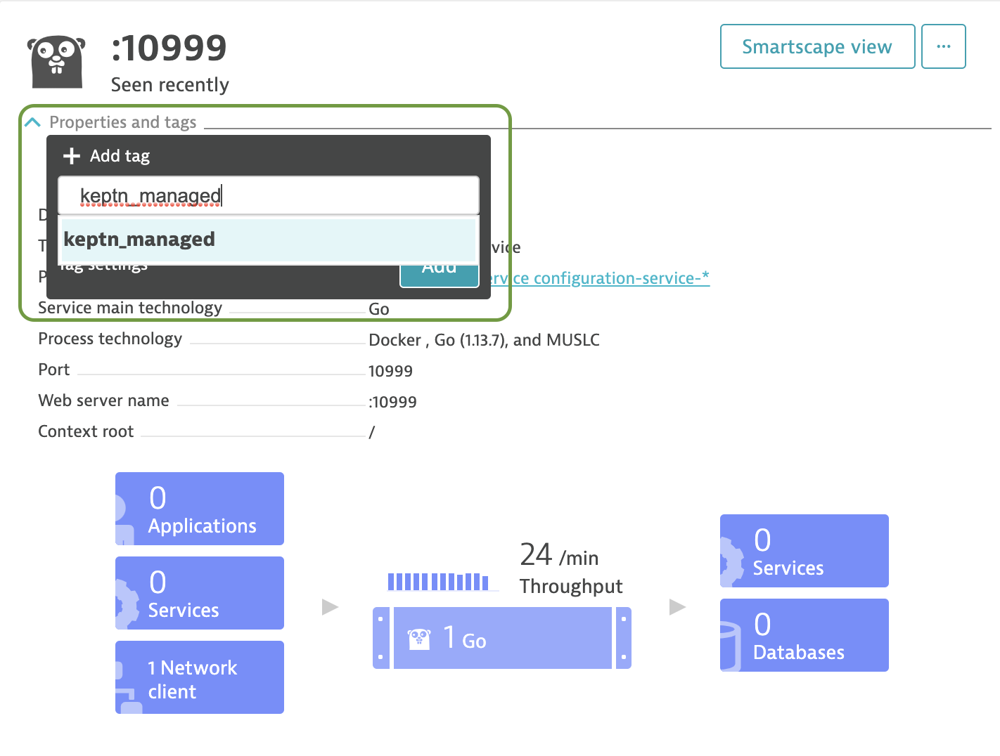

## Synchronizing Service Entities detected by Dynatrace

The *dynatrace-service* allows Service Entities detected by Dynatrace to be automatically imported into Keptn. To enable this feature, the environment variable `SYNCHRONIZE_DYNATRACE_SERVICES`
needs to be set to `true`. Once enabled, the service will by default scan Dynatrace for Service Entities every 60 seconds. This interval can be configured by changing the environment variable `SYNCHRONIZE_DYNATRACE_SERVICES_INTERVAL_SECONDS`.

To import a Service Entity into Keptn, a project with the name `dynatrace`, containing the stage `quality-gate` has to be available within Keptn. To create the project, create a `shipyard.yaml` file with the following content:

```yaml
apiVersion: "spec.keptn.sh/0.2.2"
kind: "Shipyard"
metadata:
  name: "dynatrace"
spec:
  stages:
    - name: "quality-gate"
      test_strategy: "performance"
```

Afterwards, create the project using the following command:

```console
keptn create project dynatrace --shipyard=shipyard.yaml
```

After the project has been created, you can import Service Entities detected by Dynatrace by applying the tags `keptn_managed` and `keptn_service: <service_name>`:


To set the `keptn_managed` tag, you can use the Dynatrace UI: First, in the **Transactions and services** menu, open the Service Entity you would like to tag, and add the `keptn_managed` tag as shown in the screenshot below:


 
The `keptn_service` tag can be set in two ways: 

1. Using an automated tagging rule, which can be set up in the menu **Settings > Tags > Automatically applied tags**. Within this section, add a new rule with the settings shown below:

    

1. Sending a POST API call to the `v2/tags` endpoint ([as described here](https://www.dynatrace.com/support/help/dynatrace-api/environment-api/custom-tags/post-tags/)):
    ```console
    curl -X POST "${DYNATRACE_TENANT}/api/v2/tags?entitySelector=${ENTITY_ID}" -H "accept: application/json; charset=utf-8" -H "Authorization: Api-Token ${API_TOKEN}" -H "Content-Type: application/json; charset=utf-8" -d "{\"tags\":[{\"key\":\"keptn_service\",\"value\":\"test\"}]}"
    ```

The *dynatrace-service* will then periodically check for services containing those tags and create correlating services within the `dynatrace` project in Keptn. After the service synchronization, you should be able to see the newly created services within the Bridge:


Note that if you would like to remove one of the imported services from Keptn, you will need to use the Keptn CLI to delete the service after removing the `keptn_managed` and `keptn_service` tags:

```console
keptn delete service <service-to-be-removed> --project=dynatrace
```

In addition to creating the service, the *dynatrace-service* will also upload the following default `slo.yaml` to enable the quality-gates feature for the service:

```yaml
---
spec_version: "1.0"
comparison:
  aggregate_function: "avg"
  compare_with: "single_result"
  include_result_with_score: "pass"
  number_of_comparison_results: 1
filter:
objectives:
  - sli: "response_time_p95"
    key_sli: false
    pass:             
      - criteria:
          - "<600"    
    warning:        
      - criteria:
          - "<=800"
    weight: 1
  - sli: "error_rate"
    key_sli: false
    pass:
      - criteria:
          - "<5"
  - sli: throughput
total_score:
  pass: "90%"
  warning: "75%"
```

To enable queries against the SLIs specified in the `SLO.yaml` file, the following configuration is created for the SLI configuration for the *dynatrace-service*:

```yaml
---
spec_version: '1.0'
indicators:
  throughput: "metricSelector=builtin:service.requestCount.total:merge(\"dt.entity.service\"):sum&entitySelector=type(SERVICE),tag(keptn_managed),tag(keptn_service:$SERVICE)"
  error_rate: "metricSelector=builtin:service.errors.total.rate:merge(\"dt.entity.service\"):avg&entitySelector=type(SERVICE),tag(keptn_managed),tag(keptn_service:$SERVICE)"
  response_time_p50: "metricSelector=builtin:service.response.time:merge(\"dt.entity.service\"):percentile(50)&entitySelector=type(SERVICE),tag(keptn_managed),tag(keptn_service:$SERVICE)"
  response_time_p90: "metricSelector=builtin:service.response.time:merge(\"dt.entity.service\"):percentile(90)&entitySelector=type(SERVICE),tag(keptn_managed),tag(keptn_service:$SERVICE)"
  response_time_p95: "metricSelector=builtin:service.response.time:merge(\"dt.entity.service\"):percentile(95)&entitySelector=type(SERVICE),tag(keptn_managed),tag(keptn_service:$SERVICE)"`
```

This file will be stored in the `dynatrace/sli.yaml` config file for the created service.
