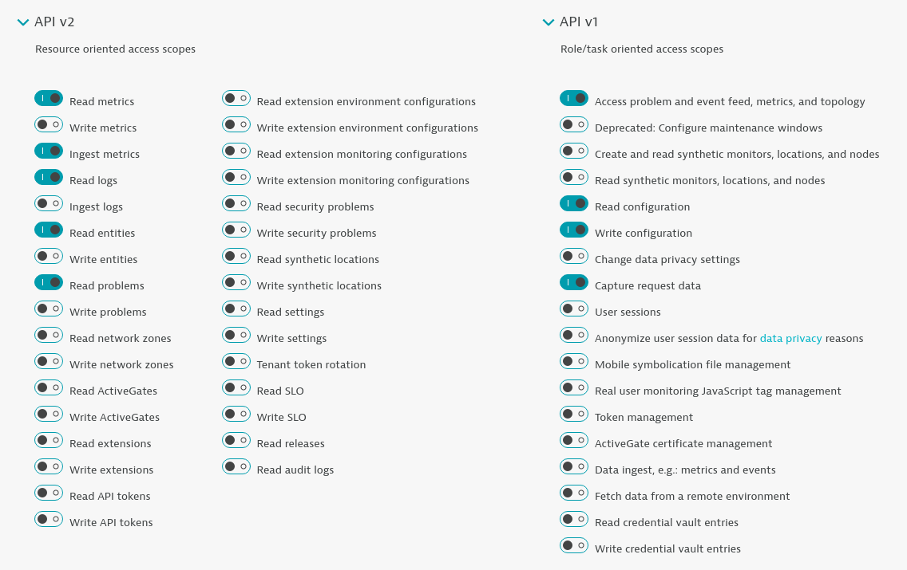
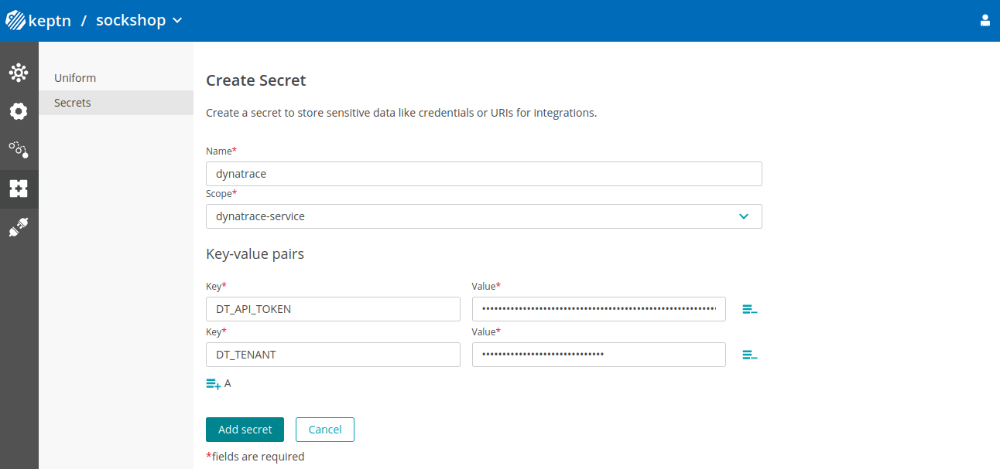
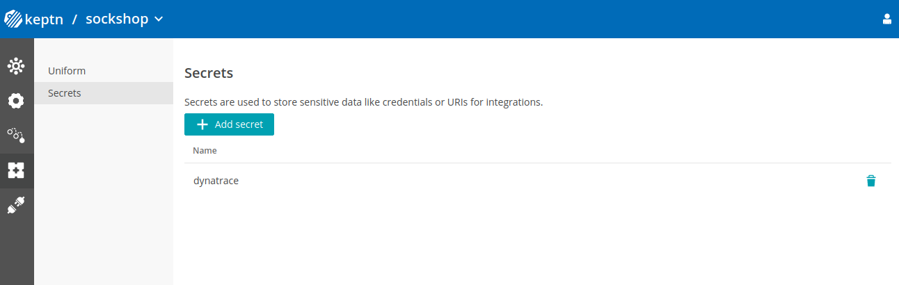

## Installation 


### 1. Gather Dynatrace credentials

To function correctly, the *dynatrace-service* requires access to a Dynatrace tenant, specified through `DT_TENANT` and `DT_API_TOKEN`:

* The `DT_TENANT` has to be set according to the appropriate pattern:
    - Dynatrace SaaS tenant: `{your-environment-id}.live.dynatrace.com`
    - Dynatrace-managed tenant: `{your-domain}/e/{your-environment-id}`

* To create a Dynatrace API token `DT_API_TOKEN`, log in to your Dynatrace tenant and go to **Manage > Settings > Integration > Dynatrace API**. In this settings page, create a new API token with the following permissions:
    - Read metrics
    - Ingest metrics
    - Read logs
    - Read entities
    - Read problems
    - Access problem and event feed, metrics, and topology
    - Read configuration
    - Write configuration
    - Capture request data   
  
  

* If running on a Unix/Linux based system, you can use environment variables to simplify the process of creating the credentials secret. Alternatively, It is also fine to just replace the variables with values in the `keptn` command in the following section.

    ```console
    DT_API_TOKEN=<DT_API_TOKEN>
    DT_TENANT=<DT_TENANT>
    ```

### 2. Create a secret with credentials

There are two ways of creating a secret

#### Create a secret with Keptn CLI

Create a secret (named `dynatrace` by default) containing the credentials for the Dynatrace Tenant (`DT_API_TOKEN` and `DT_TENANT`).

  ```console
  keptn create secret dynatrace --scope="dynatrace-service" --from-literal="DT_TENANT=$DT_TENANT" --from-literal="DT_API_TOKEN=$DT_API_TOKEN"
  ```

#### Create a secret with Keptn Bridge

Navigate to your Keptn environment pointed to by `KEPTN_BRIDGE_URL` and go to **Keptn Uniform** screen. In the sub menu click on **Secrets** and add a new secret with scope `dynatrace-service`. Make sure that you have two key-value pairs - one for `DT_API_TOKEN` and one for `DT_TENANT`.



After clicking **Add Secret** you should see an updated list of secrets including the one you just created.




### 3. Gather Keptn credentials

The *dynatrace-service* also requires access to the Keptn API, provided through the `KEPTN_API_URL`, `KEPTN_API_TOKEN` and optionally `KEPTN_BRIDGE_URL`:

* To get the values for `KEPTN_API_URL` (also known as `KEPTN_ENDPOINT`), please see [Authenticate Keptn CLI](https://keptn.sh/docs/0.10.x/operate/install/#authenticate-keptn-cli).

* By default the `KEPTN_API_TOKEN` is read from the `keptn-api-token` secret (i.e. the secret from the control-plane) and does not need to be set during installation.

* If you would like to use backlinks from your Dynatrace tenant to the Keptn Bridge, provide the service with `KEPTN_BRIDGE_URL`. For further details about this value, please see [Authenticate Keptn Bridge](https://keptn.sh/docs/0.10.x/operate/install/#authenticate-keptn-bridge).

* Similarly to the Dynatrace tenant credentials, if running on a Unix/Linux based system, you can use environment variables to set the values of the credentials. It is also fine to just replace the variables with values in the `helm` command in the following section.

    ```console
    KEPTN_API_URL=<KEPTN_API_URL>
    KEPTN_BRIDGE_URL=<KEPTN_BRIDGE_URL> # optional
    ```

### 4. Deploy the Dynatrace Keptn integration

The Dynatrace integration into Keptn is handled by the *dynatrace-service*.

* Specify the version of the dynatrace-service you want to deploy. Please see the [compatibility matrix](https://github.com/keptn-contrib/dynatrace-service#compatibility-matrix) of the dynatrace-service to pick the version that works with your Keptn.

    ```console
    VERSION=<VERSION>   # e.g.: VERSION=0.17.1
    ```

*  To install the *dynatrace-service*, execute:

    ```console
    helm upgrade --install dynatrace-service -n keptn \
      https://github.com/keptn-contrib/dynatrace-service/releases/download/$VERSION/dynatrace-service-$VERSION.tgz \
      --set dynatraceService.config.keptnApiUrl=$KEPTN_API_URL \
      --set dynatraceService.config.keptnBridgeUrl=$KEPTN_BRIDGE_URL \
      --set dynatraceService.config.generateTaggingRules=true \
      --set dynatraceService.config.generateProblemNotifications=true \
      --set dynatraceService.config.generateManagementZones=true \
      --set dynatraceService.config.generateDashboards=true \
      --set dynatraceService.config.generateMetricEvents=true
    ```
**Notes**: 
* Variables may be set by appending key-value pairs with the syntax `--set key=value`

* The `dynatrace-service` can automatically generate tagging rules, problem notifications, management zones, dashboards, and custom metric events in your Dynatrace tenant. You can configure whether these entities should be generated within your Dynatrace tenant by the environment variables specified in the provided `chart/values.yaml`, i.e. using the variables `dynatraceService.config.generateTaggingRules` (default `false`), `dynatraceService.config.generateProblemNotifications` (default `false`), `dynatraceService.config.generateManagementZones` (default `false`), `dynatraceService.config.generateDashboards` (default `false`), `dynatraceService.config.generateMetricEvents` (default `false`), and `dynatraceService.config.synchronizeDynatraceServices` (default `true`).
 
* The `dynatrace-service` by default validates the SSL certificate of the Dynatrace API. If your Dynatrace API only has a self-signed certificate, you can disable the SSL certificate check by setting the environment variable `dynatraceService.config.httpSSLVerify` (default `true`) specified in the [values.yml](https://raw.githubusercontent.com/keptn-contrib/dynatrace-service/$VERSION/chart/values.yaml) to `false`.

* The `dynatrace-service` can be configured to use a proxy server via the `HTTP_PROXY`, `HTTPS_PROXY` and `NO_PROXY` environment variables as described in [`httpproxy.FromEnvironment()`](https://golang.org/pkg/vendor/golang.org/x/net/http/httpproxy/#FromEnvironment). As the `dynatrace-service` connects to a `distributor` as well as to some Keptn services directly, a `NO_PROXY` entry including `"127.0.0.1,mongodb-datastore,configuration-service,shipyard-controller"` should be used to prevent these from being proxied. These environment variables can be configured using the `dynatraceService.config.httpProxy`, `dynatraceService.config.httpsProxy` and `dynatraceService.config.noProxy` variables defined in [values.yml](https://raw.githubusercontent.com/keptn-contrib/dynatrace-service/$VERSION/chart/values.yaml). For example:

  ```console
  helm upgrade --install dynatrace-service -n keptn https://github.com/keptn-contrib/dynatrace-service/releases/download/$VERSION/dynatrace-service.tgz --set dynatraceService.config.httpProxy=http://mylocalproxy:1234 --set dynatraceService.config.httpsProxy=https://mylocalproxy:1234
  ```

* When an event is sent out by Keptn, you see an event in Dynatrace for the correlating service:

  

### 4. (Optional) Set up Dynatrace monitoring for existing Keptn projects

If you already have created a project using Keptn and would like to enable Dynatrace monitoring for that project afterwards, please execute the following command:

```console
keptn configure monitoring dynatrace --project=<PROJECT_NAME>
```

**ATTENTION:** If you have different Dynatrace Tenants (or Managed Environments) and want to make sure a Keptn project is linked to the correct Dynatrace Tenant/Environment please have a look at the `dynatrace.conf.yaml` file option as explained below. It allows you to specify which Dynatrace Tenant/Environment to use on a project level. This requires that you first upload `dynatrace.conf.yaml` on project level before executing `keptn configure monitoring`.

## Additional Installation Options

### Configuration of project- & Keptn-wide Dynatrace credentials

The service you the option to configure project-wide-default or keptn-wide-default credentials. For project-wide, the secret needs to be named  `dynatrace-credentials-YOURPROJECT`. For keptn-wide the secret can either be called `dynatrace-credentials` or just `dynatrace`.

The following is an example to define a secret for a Keptn project called sockshop:

```console
kubectl create secret generic dynatrace-credentials-sockshop -n "keptn" --from-literal="DT_TENANT=$DT_TENANT" --from-literal="DT_API_TOKEN=$DT_API_TOKEN"
```

And here is an example to specify a Keptn-wide default secret that is used in case there is no project-wide secret defined for a particular Keptn project

```console
kubectl create secret generic dynatrace -n "keptn" --from-literal="DT_TENANT=$DT_TENANT" --from-literal="DT_API_TOKEN=$DT_API_TOKEN"
```

### Configurations of Credentials through `dynatrace.conf.yaml`

More fine grained control over Dynatrace Credential Management as well as configuring the behavior of other features of the *dynatrace-service* on a project, service and stage level is provided through `dynatrace.conf.yaml` files. 

When the *dynatrace-service* is processing a *sh.keptn.internal.event.get-sli* event it looks for the file called `dynatrace/dynatrace.conf.yaml` in the Keptn Configuration Repository. It first looks for it on the service, then the stage and then finally the project level. This configuration file allows you to configure the following behavior:
* Which k8s secret to use to pull Dynatrace Tenant Credentials (`DT_TENANT` & `DT_API_TOKEN`)
* Whether to pull SLI/SLO information from a Dynatrace dashboard or use the stored `sli.yaml` and `slo.yaml` in the Keptn Configuration Repository

Here is an example `dynatrace.conf.yaml`:

```yaml
spec_version: '0.1.0'
dtCreds: dynatrace-preprod
dashboard: query
```

To upload this to your Keptn project you can for instance use the Keptn CLI:

```console
keptn add-resource --project=yourproject --stage=yourstage --resource=./dynatrace.conf.yaml --resourceUri=dynatrace/dynatrace.conf.yaml
```

**`dtCreds`**

`dtCreds` allows you to specify the name of the k8s secret in your Keptn namespace that holds the required credentials to connect to the Dynatrace Tenant. This extends the default behavior as explained in the beginning by having the *dynatrace-service* first look at the secret defined in dtCreds. If `dtCreds` is not specified or if there is no `dynatrace.conf.yaml` at all then it just does the default behavior.

In the example above where `dtCreds` was specified with the value *dynatrace-preprod* the *dynatrace-service* would be looking for the first matching secret in the following order: *dynatrace-preprod*, *dynatrace-credentials-YOUR-KEPTN-PROJECT*, *dynatrace-credentials*, *dynatrace*
If none of these secrets is configured in your k8s Keptn namespace the *dynatrace-service* will respond with an error indicating that no Dynatrace credentials could be found!

For completeness, here is an example of how to create a secret that matches the `dynatrace.conf.yaml`:

```console
kubectl create secret generic dynatrace-preprod -n "keptn" --from-literal="DT_TENANT=$DT_TENANT" --from-literal="DT_API_TOKEN=$DT_API_TOKEN"
```

`dtCreds` was requested by many users as it gives you the option to specify credentials for your different Dynatrace Tenants, e.g. my-dynatrace-preprod, my-dynatrace-prod, my-dynatrace-dev. And then you can configure on project, stage or even service level which Dynatrace Tenant to be used. This gives you all flexiblity to manage multiple environments within a single project but separate it out by e.g. stages.
