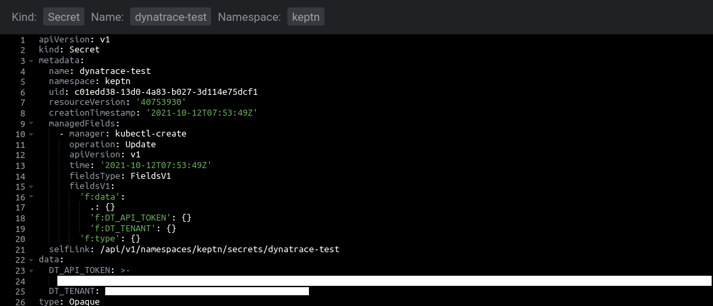
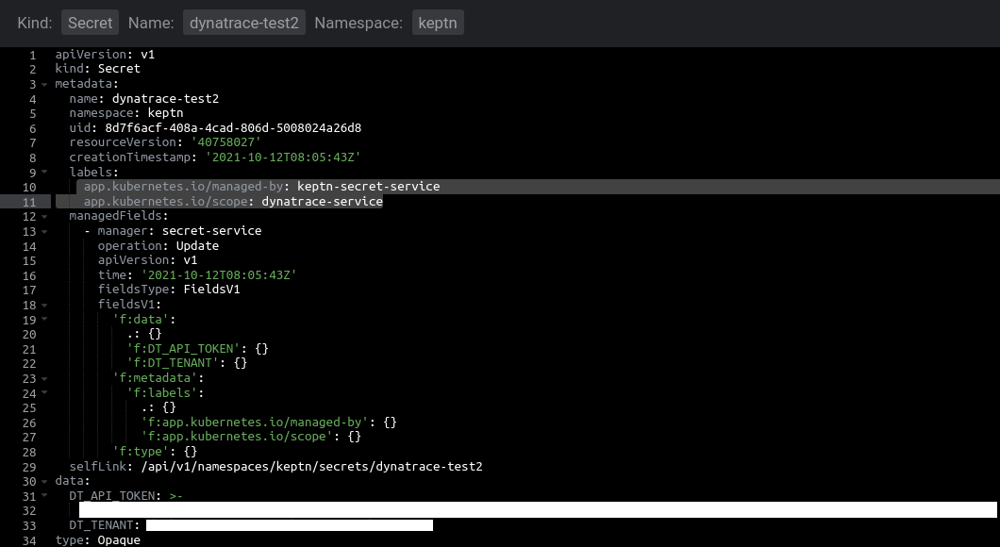

## Changes to the access rights of the ServiceAccount

Prior to dynatrace-service version `0.18.0` and Keptn version `0.10.0` you will probably have created your Dynatrace secret in a way similar to this:

```shell
kubectl -n keptn create secret generic dynatrace \
--from-literal="DT_API_TOKEN=$DT_API_TOKEN" \
--from-literal="DT_TENANT=$DT_TENANT" \
-oyaml --dry-run=client | kubectl replace -f -
```

This would have resulted in a secret looking similar to this:



From dynatrace-service version `0.18.0` onwards its service account will no longer have the rights to read all secrets that are available, but only those that are bound to a specific read-only role. 
This is automatically done if you create your secret with the Keptn Secret Service (from version `0.10.0` onwards) via the Uniform UI. Please see [project setup details](project-setup.md#create-a-secret-with-keptn-bridge) for further information on how to do this.

A secret created by the Keptn Secret Service will look like this (please note the labels `managed-by` and `scope`):




### How to migrate your existing secrets

If you have used the dynatrace-service before, you will most likely have existing secrets and upgrading to version `0.18.0` would result in problems reading the Dynatrace secrets. It will no longer have the appropriate access rights. 

Here are two suggested migration workflows to go forward before upgrading to version `0.18.0`. Either automatically or manually. 


#### Automatically add a Kubernetes role and role binding and patch your secrets.

If you have multiple secrets - e.g., for different projects, stages, services then manually deleting and recreating the secrets would be a cumbersome process. In order to make migration as seamless as possible we provide a script that will do the heavy lifting for you.

The script will do the following:
- updates all existing Dynatrace secrets (each secret that has a key `DT_TENANT`) with labels `app.kubernetes.io/managed-by: keptn-secret-service` and `app.kubernetes.io/scope: dynatrace-service`. This is basically the same that the Keptn Secret Service would do, if you would create a new secret via the UI in Keptn Bridge
- adds a role `keptn-dynatrace-svc-read` that is restricted to reading secrets, and it will list all available Dynatrace secret resource names.
- adds a role binding `dynatrace-service-rolebinding` that will bind the service account to the above role 

Here's the script: [Patch Dynatrace Secrets](assets/patch-dynatrace-secrets.sh?raw=true)

*Note: you can also do a dry run, to validate which commands would be executed*
```shell
bash ./patch-dynatrace-secrets.sh --dry-run
```


#### Recreate your existing secrets using Keptn Bridge

If you wish to "migrate" your secrets manually then you can do so as well from Keptn version `0.10.0` onwards:

- Delete your existing secrets. *Replace `<your-secret-name>` with the name of the secret. In my case - as shown above - it would be `dynatrace-test`*.
  ```console
  kubectl delete secret <your-secret-name> -n keptn 
  ```
  Repeat this step for all your existing secrets.
- Recreate all your secrets using Keptn Bridge. Please see [project setup details](project-setup.md#create-a-secret-with-keptn-bridge) for further information on how to do this.

