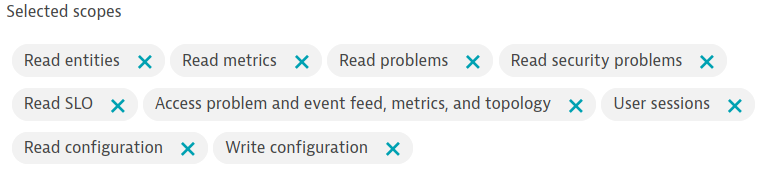
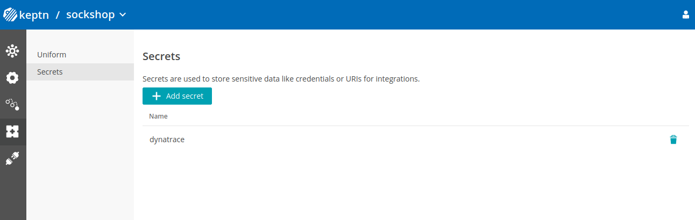

# Set up a Keptn project to use Dynatrace monitoring

To use the dynatrace-service in a new or existing Keptn project, create a Kubernetes secret for accessing a Dynatrace tenant, add a dynatrace-service configuration file (`dynatrace/dynatrace.conf.yaml`) to the project's Git repository, and execute `keptn configure monitoring` using the Keptn CLI.


## Prerequisite: Keptn project

Before continuing, please ensure a Keptn project is available with a valid Git upstream repository. For instructions, please see [Create a project](https://keptn.sh/docs/0.11.x/manage/project/#create-a-project) in the Keptn documentation.


## 1. Create a Dynatrace API credentials secret

To function correctly, the dynatrace-service requires a Kubernetes secret containing the credentials for accessing the API of a Dynatrace tenant. The secret must have two components with the key names `DT_TENANT` and `DT_API_TOKEN`:

* The `DT_TENANT` has to be set according to the appropriate pattern:
    - Dynatrace SaaS tenant: `<your-environment-id>.live.dynatrace.com`
    - Dynatrace-managed tenant: `<your-domain>/e/{your-environment-id}`

* To create a Dynatrace API token `DT_API_TOKEN`, log in to your Dynatrace tenant and go to **Manage > Settings > Integration > Dynatrace API**. In this settings page, create a new API token with the following permissions:
    - Read metrics
    - Ingest metrics
    - Read logs
    - Read entities
    - Read problems
    - Access problem and event feed, metrics, and topology
    - Read configuration
    - Write configuration
    - Capture request data   
  
  

The actual Kubernetes secret can be created using the Keptn Bridge UI or the Keptn CLI. Both of these methods ensure that the resulting secret has the correct Kubernetes labels (`app.kubernetes.io/managed-by=keptn-secret-service`, `app.kubernetes.io/scope=dynatrace-service`) and is bound to the correct role (`
keptn-dynatrace-svc-read`) which allow the dynatrace-service to access it.

Note: Secrets can also be shared among multiple Keptn projects that utilize the same Dynatrace tenant.


### Create a secret with Keptn CLI

If running on a Unix/Linux based system, you can use environment variables to simplify the process of creating the credentials secret. Alternatively, it is also fine to just replace the variables with values in the next `keptn` command.

```console
DT_API_TOKEN=<DT_API_TOKEN>
DT_TENANT=<DT_TENANT>
```

To create  a secret (named `dynatrace` by default) containing the credentials for the Dynatrace Tenant (`DT_API_TOKEN` and `DT_TENANT`), execute the following CLI command:

  ```console
  keptn create secret dynatrace --scope="dynatrace-service" --from-literal="DT_TENANT=$DT_TENANT" --from-literal="DT_API_TOKEN=$DT_API_TOKEN"
  ```


### Create a secret with Keptn Bridge

Navigate to your Keptn Bridge and go to the **Keptn Uniform** screen. In the sub menu click on **Secrets** and add a new secret with scope `dynatrace-service`. Make sure that you add two key-value pairs - one for `DT_API_TOKEN` and one for `DT_TENANT`.


After clicking **Add Secret** you should see an updated list of secrets including the one you just created.




## 2. Create a dynatrace-service configuration file (`dynatrace/dynatrace.conf.yaml`)

To utilize the dynatrace-service with your Keptn project, add a configuration file (located at `dynatrace/dynatrace.conf.yaml`) to project's Git repository. At a minimum, this YAML file instructs the dynatrace-service about which Dynatrace credentials secret to use, but depending on the use-case, specifies how to retrieve SLIs, and optionally, which attach rules to add to a Dynatrace tenant. See [Configuring the dynatrace-service with `dynatrace/dynatrace.conf.yaml`](dynatrace-conf-yaml-file.md) for details. The [minimum configuration](assets/dynatrace.conf.yaml) is:

```yaml
spec_version: '0.1.0'
dtCreds: dynatrace
```


## 3. Configure Dynatrace as the monitoring provider

To complete the project setup, run the following `keptn configure monitoring` command:

```console
keptn configure monitoring dynatrace --project=<PROJECT_NAME>
```

This will ensure that the dynatrace-service is set as the SLI provider for the project. If configured to do so, the dynatrace-service will also generate entities on the Dynatrace tenant at this time, as described in [Automatic configuration of a Dynatrace tenant](auto-tenant-configuration.md)
