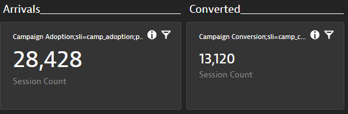

# SLI and SLO configuration

## Configurations of Dashboard SLI/SLO queries through `dynatrace.conf.yaml`

The `dynatrace.conf.yaml` provides the `dashboard` option to configure whether the *dynatrace-service* should use the metric queries defined in `sli.yaml`, whether it should pull data from a specific dashboard or whether it should query the data from a Dynatrace Dashboard whose name matches the Keptn project, stage and service. 

Here is an example `dynatrace.conf.yaml` including the `dashboard` parameter:

```yaml
---
spec_version: '0.1.0'
dtCreds: dynatrace-prod
dashboard: query
```

This file should be uploaded into the `dynatrace` subfolder, e.g. using the Keptn CLI:

```console
keptn add-resource --project=yourproject --stage=yourstage --resource=./dynatrace.conf.yaml --resourceUri=dynatrace/dynatrace.conf.yaml
```

The `dashboard` parameter provides 3 options:

* blank (default): If `dashboard` is not specified at all or if you do not even have a `dynatrace.conf.yaml` then the *dynatrace-service* will simply execute the metric query as defined in `slo.yaml`
* `query`: This value means that the *dynatrace-service* will look for a dashboard on your Dynatrace Tenant (dynatrace-prod in the example above) which has the following dashboard naming format: `KQG;project=<YOURKEPTNPROJECT>;service=<YOURKEPTNSERVICE>;stage=<YOURKEPTNSTAGE>`. If such a dashboard exists it will use the definition of that dashboard for SLIs as well as SLOs. If no dashboard is found that matches that name it goes back to default mode.
* DASHBOARD-UUID: If you specify the UUID of a Dynatrace dashboard the *dynatrace-service* will query this dashboard on the specified Dynatrace Tenant. If it exists it will use the definition of this dashboard for SLIs as well as SLOs. If the dashboard was not found the *dynatrace-service* will raise an error.

Here is an example of a `dynatrace.conf.yaml` specifing the UUID of a Dynatrace Dashboard:

```yaml
---
spec_version: '0.1.0'
dtCreds: dynatrace-prod
dashboard: 311f4aa7-5257-41d7-abd1-70420500e1c8
```

*Dashboard parsing behavior*

If a dashboard is queried, the *dynatrace-service* will first validate if the dashboard has changed since the last evaluation. It does that by comparing the dashboard's JSON with the dashboard JSON that was used during the last evaluation run. If the `dashboard.json` has not changed it will fall back to the `sli.yaml` and `slo.yaml` as these were also created out of the dashboard in the previous run. If you want to overwrite this behavior you can simply put a `KQG.QueryBehavior=Overwrite` on your dashboard. Details on that explained further down in this readme.

This behavior also implies that the *dynatrace-service* stores the content of the dashboard and the generated `sli.yaml` and `slo.yaml` in your configuration repo. You can find these files on service level under `dynatrace/dashboard.json`, `dynatrace/sli.yaml` and `slo.yaml`.

**Tip:** You can easily find the dashboard id for an existing dashboard by navigating to it in your Dynatrace Web interface. The ID is then part of the URL.

## SLI Configuration

While most users will use the dashboard approach it is important to understand how the general processing of SLIs works without dashboards. Dashboards give an additional convenience as the `sli.yaml` file doesn't need to be created or maintained by anybody as this information is extracted from a Dynatrace Dashboard. However - in very mature organizations the approach of using SLI & SLO YAML files instead of Dynatrace Dashboards is very likely.

Thats why - lets give you some basic understanding of how SLIs work with the *dynatrace-service*.

The default SLI queries that come with the *dynatrace-service* are defined as follows and will be used in case you have not specified a custom `sli.yaml` or a Dynatrace dashboard:

```yaml
spec_version: "1.0"
indicators:
 throughput: "metricSelector=builtin:service.requestCount.total:merge(0):sum&entitySelector=tag(keptn_project:$PROJECT),tag(keptn_stage:$STAGE),tag(keptn_service:$SERVICE),tag(keptn_deployment:$DEPLOYMENT),type(SERVICE)"
 error_rate: "metricSelector=builtin:service.errors.total.rate:merge(0):avg&entitySelector=tag(keptn_project:$PROJECT),tag(keptn_stage:$STAGE),tag(keptn_service:$SERVICE),tag(keptn_deployment:$DEPLOYMENT),type(SERVICE)"
 response_time_p50: "metricSelector=builtin:service.response.time:merge(0):percentile(50)&entitySelector=tag(keptn_project:$PROJECT),tag(keptn_stage:$STAGE),tag(keptn_service:$SERVICE),tag(keptn_deployment:$DEPLOYMENT),type(SERVICE)"
 response_time_p90: "metricSelector=builtin:service.response.time:merge(0):percentile(90)&entitySelector=tag(keptn_project:$PROJECT),tag(keptn_stage:$STAGE),tag(keptn_service:$SERVICE),tag(keptn_deployment:$DEPLOYMENT),type(SERVICE)"
 response_time_p95: "metricSelector=builtin:service.response.time:merge(0):percentile(95)&entitySelector=tag(keptn_project:$PROJECT),tag(keptn_stage:$STAGE),tag(keptn_service:$SERVICE),tag(keptn_deployment:$DEPLOYMENT),type(SERVICE)"
```

**Note:** The default SLI queries require the following tags on the services and within the query:

* `keptn_project`
* `keptn_stage`
* `keptn_service`
* `keptn_deployment`

When Keptn queries these SLIs for e.g. the service `carts` in the stage `dev` within project `sockshop`, it would translate to the following tags in the query:

* `keptn_project:sockshop`
* `keptn_stage:dev`
* `keptn_service:carts`
* `keptn_deployment:primary` (or `keptn_deployment:canary` during tests)

If you use Keptn for the deployment of your artifacts using Keptn's Helm Service you will have these four tags automatically set and detected by Dynatrace. If you want to use other tags, you need to overwrite the SLI configuration (see below).

### Overwrite SLI Configuration / Custom SLI queries

Users can override the predefined queries, as well as add custom queries by creating a SLI configuration: 

* A custom SLI configuration is a YAML file as shown below:

    ```yaml
    ---
    spec_version: "1.0"
    indicators:
      your_metric: "metricSelector=your_metric:count&entitySelector=tag(keptn_project:$PROJECT),tag(keptn_stage:$STAGE),tag(keptn_service:$SERVICE),tag(keptn_deployment:$DEPLOYMENT),type(SERVICE)"
    ```

* To store this configuration, you need to add this file to Keptn's configuration store either on project, stage, or service level. The remote `resourceUri` needs to be `dynatrace/sli.yaml`. This is done by using the Keptn CLI with the [keptn add-resource](https://keptn.sh/docs/0.8.x/reference/cli/commands/keptn_add-resource/) command:

    ```console
    keptn add-resource --project=yourproject --stage=yourstage --service=yourservice --resource=./sli.yaml --resourceUri=dynatrace/sli.yaml
    ```

### More examples on custom SLIs

You can define your `sli.yaml` that defines ANY type of metric available in Dynatrace - on ANY entity type (APPLICATION, SERVICE, PROCESS GROUP, HOST, CUSTOM DEVICE, etc.). You can either "hard-code" the queries in your `sli.yaml` or you can use placeholders such as $SERVICE, $STAGE, $PROJECT, $DEPLOYMENT as well as $LABEL.yourlabel1, $LABEL.yourlabel2. This is very powerful as you can define generic `sli.yaml` files and leverage the dynamic data of a Keptn event.

Here is an example where we are retrieving the tag name from a label that is passed to Keptn:

```yaml
indicators:
    throughput:  "metricSelector=builtin:service.requestCount.total:merge(0):sum&entitySelector=tag($LABEL.dttag),type(SERVICE)"
```

So, if you are sending an event to Keptn and passing in a label with the name `dttag` and a value e.g. `evaluateforsli` then it will match a Dynatrace service that has this tag on it:


You can also have SLIs that span multiple layers of your stack, e.g. services, process groups and host metrics. Here is an example that queries one metric from a service, one from a process group and one from a host. The tag names come from labels that are sent to Keptn:

```yaml
indicators:
    throughput:  "metricSelector=builtin:service.requestCount.total:merge(0):sum&entitySelector=tag($LABEL.dtservicetag),type(SERVICE)"
    gcheapuse:   "metricSelector=builtin:tech.nodejs.v8heap.gcHeapUsed:merge(0):sum&entitySelector=tag($LABEL.dtpgtag),type(PROCESS_GROUP_INSTANCE)"
    hostmemory:  "metricSelector=builtin:host.mem.usage:merge(0):avg&entitySelector=tag($LABEL.dthosttag),type(HOST)"
```

Hopefully these examples help you see what is possible. If you want to explore more about Dynatrace Metrics, and the queries you need to create to extract them I suggest you explore the Dynatrace API Explorer (Swagger UI) as well as the [Metric API v2](https://www.dynatrace.com/support/help/extend-dynatrace/dynatrace-api/environment-api/metric-v2/) documentation.

### Advanced SLI Queries for Dynatrace

Here are a couple of additional query options that have been added to the Dynatrace SLI Service over time to extend the capabilities of querying more relevant data:

**Dynatrace SLO Definition**

With Dynatrace Version 207, Dynatrace introduced native support for SLO monitoring. The *dynatrace-service* is able to query these SLO definitions by referencing them by SLO-ID. Here is such an SLO as seen in a dashboard:


And here is the corresponding SLI query which is specified as `SLO;<SLOID>`:

```yaml
indicators:
    rt_faster_500ms: SLO;524ca177-849b-3e8c-8175-42b93fbc33c5
```

The *dynatrace-service* basically queries the SLO using the `/api/v2/slo/<sloid>` endpoint and will return evaluatedPercentage field!

**Open Problems**
One interesting metric is the number of open problems you may have in a particular environment or those that match a particular problem type. Dynatrace provides the Problem APIv2 which allows you to query problems by `entitySelector` as well as `problemSelector`. You can pass both fields as part of an SLI query prefixing it with `PV2`. Here is an example on how such an SLI definition would look like:

```yaml
indicators:
    problems: PV2;problemSelector=status(open)&entitySelector=managementZoneIds(7030365576649815430)
```

The *dynatrace-service* will return the totalCount field of the `/api/v2/problems` endpoint passing your query string!

**Define Metric Unit for Metrics Query**

Most SLIs you define are queried using the Metrics API v2. The following is an example from above:

```yaml
indicators:
 teststep_rt_Basic_Check: "metricSelector=calc:service.teststepresponsetime:merge(0):avg:names:filter(eq(Test Step,Basic Check));entitySelector=type(SERVICE)"
```

When the *dynatrace-service* executes this query it simply returns the value of that metric. What is not always known is the metric unit. Depending on the metric definition this could be nanoseconds, microseconds, milliseconds or seconds or even bytes, kilobytes or megabytes.

For some of the metrics the *dynatrace-service* makes metric unit assumptions and for instance converts MicroSecond into MilliSeconds and Bytes into KiloBytes. However, these assumptions only work for builtin metrics and are therefore not a valid approach unless we would start querying the Metric Definition everytime we query these metrics. While this would work it is a lot of extra API calls we want to avoid.

To let the *dynatrace-service* know about the expected *Metric Unit* you can prefix your query with `MV2;<MetricUnit>;<Regular Query>`. So - the above example can be changed to this to tell the service that this metric is returned in MicroSeconds:

```yaml
indicators:
 teststep_rt_Basic_Check: "MV2;MicroSecond;metricSelector=calc:service.teststepresponsetime:merge(0):avg:names:filter(eq(Test Step,Basic Check));entitySelector=type(SERVICE)"
```

The possible metric units are those that Dynatrace specifies in the API. Please have a look at the Metric API documentation for a complete overview.

Currently the *dynatrace-service* does the following conversions before returning the value to Keptn. While this doesnt yet solve every request we have seen from our users I hope this solves many use cases of users asking for better handling of MicroSeconds and Bytes:

| Source Data Tye | Converted To |
|:----------------|:-----------------|
| MicroSeconds | MilliSeconds |
| Bytes | KiloBytes |

If you want to have a more flexible way to convert metric units please let us know by creating an issue and explaining your use case.

## SLIs & SLOs for Problem Remediation

If Dynatrace sends problems to Keptn which triggers an Auto-Remediation workflow, Keptn also evaluates your SLOs after the remediation action was executed.
The default behavior that users expect is that the auto-remediation workflow can stop if the problem has been closed in Dynatrace and that it should continue otherwise!

When a Dynatrace Problem initiates a Keptn auto-remediation workflow the *dynatrace-service* adds the Dynatrace Problem URL as a label with the name "Problem URL". As labels are passed all the way through every event along a Keptn process it also ends up being passed as part of the `sh.keptn.internal.event.get-sli` which is handled by the *dynatrace-service*.

Here is an excerpt of that event showing the label:

```json
 "labels": {
      "Problem URL": "https://abc12345.live.dynatrace.com/#problems/problemdetails;pid=3734886735257827488_1606270560000V2",
      "firstaction": "action.triggered.firstaction.sh"
    },
    "project": "demo-remediation"
```

So, if the *dynatrace-service* detects that it gets called in context of a remediation workflow and finds a Dynatrace Problem ID (PID) as part of the Problem URL it will query the status of that problem (OPEN or CLOSED) using Dynatrace's Problem API v2. It will then return an SLI called `problem_open` and the value  either be `0` (=problem no longer open) or `1` (=problem still open).

The *dynatrace-service* will also define a key SLO for `problem_open` with a default pass criteria of `<=0` meaning the evaluation will only succeed if the problem is closed. The following is an excerpt of that SLO definition:

```yaml
objectives:
- sli: problem_open
  pass:
  - criteria:
    - <=0
  key_sli: true
```

As the SLO gets added if it's not defined and as the sli named `problem_open` will always be returned this capability allows you to either define your own custom SLO including `problem_open` as an SLO or you just go with the default that *dynatrace-service* creates.

## SLIs & SLOs via Dynatrace Dashboard

Based on user feedback we learned that defining custom SLIs via the `sli.yaml` and then defining SLOs via `slo.yaml` can be challenging as one has to be familiar with the Dynatrace Metrics v2 API to craft the necessary SLI queries.

As dashboards are a prominent feature in Dynatrace to visualize metrics, it was a logical step to leverage dashboards as the basis for Keptn's SLI/SLO configuration.

If *dynatrace-service* parses your dashboard, it will generate an `sli.yaml` and `slo.yaml` and uploads it to your Keptn configuration repository. It will also upload the `dashboard.json`. 

### How dynatrace-service locates a Dashboard

As explained earlier, the *dynatrace-service* gives you two options through the `dashboard` property in your `dynatrace.conf.yaml`

1. `query`. This will query for a dashboard with the name pattern like this: KQG;project=<YOURKEPTNPROJECT>;service=<YOURKEPTNSERVICE>;stage=<YOURKEPTNSTAGE>

2. UUID: Use e.g: `dashboard: e6c947f2-4c29-483c-a065-269b3707bea4` which will then query exactly that dashboard

For more details refer to the section above where we explained `dynatrace.conf.yaml`

### SLI/SLO Dashboard Layout and how it generates SLI & SLO definitions

Here is a sample dashboard for our simplenode sample application:


And here is how the individual pieces matter:

**1. Name of the dashboard**

If the dashboard is not referenced in `dynatrace.conf.yaml` via the Dashboard ID, the *dynatrace-service* queries all dashboards and uses the one that starts with `KQG;` followed by the name-value pairs:

```
project=<project>,service=<service>,stage=<stage>
```

The order of these name-value pairs is not relevant but the values have to match your Keptn project, service and stage. In the example dashboard you see that this dashboard matches the project *simpleproject*, service *simplenode*, and stage *staging*.

**2. Management Zone Filter**

If you are building a dashboard specific to an application or part of your environment, it is a good practice to set a default management zone filter for your dashboard. The *dynatrace-service* will use that filter. This can either be a custom created management zone or - like in the example above - the one that Keptn creates in case you use Keptn for the deployment.

**3. Markdown with SLO Definitions**

The dashboard is not only used to define which metrics should be evaluated (list of SLIs), it is also used to define the individual SLOs and global settings for the SLO, e.g., *Total Score* goals or *Comparison Rules*. These are settings you normally have in your `slo.yaml`.
To specify those settings simply create a markdown that contains name-value pairs like in the example dashboard.

Here is the text from that markup you see in the screenshot:
```
KQG.Total.Pass=90%;KQG.Total.Warning=75%;KQG.Compare.WithScore=pass;KQG.Compare.Results=1;KQG.Compare.Function=avg
```

It is not mandatory to define them as there are defaults for all of them. Here is a table that gives you the details on each setting:

| Setting | Default | Comment |
|:------|:-------|:-------|
| KQG.Total.Pass | 90% | Specifies total pass goal of your SLO |
| KQG.Total.Warning | 75% | Specifies total warning goal of your SLO |
| KQG.Compare.Result | 1 | Against how many previous builds to compare your result to? |
| KQG.Compare.WithScore | pass | Which prevoius builds to include in the comparison: pass, pass_or_warn or all |
| KQG.Compare.Function | avg | When comparing against multiple builds which aggregation should be used: avg, p50, p90, p95 |
| KQG.QueryBehavior | <empty> | A dashboard is always parsed for SLIs & SLOs even if it hasnt changed. To only parse it when changes occured use 'ParseOnChange' |


**4. Tiles with SLI definition**

The *dynatrace-service* analyzes every tile but only includes those in the SLI/SLO anlaysis where the tile name includes the name-value pair: `sli=sliprefix`

If you look at the example dashboard screenshot, you see some tiles that have the `sli=sliprefix` and some that don't. This allows you to build dashboards that you can extend with metrics that should not be included in your SLI/SLO validation.

Similar to the markdown, each tile can define several configuration elements. The only mandatory is sli=sliprefix.
Here a couple of examples of possible values. It actually starts with a human readable value that is not included in the analysis but makes the dashboard more readable:

```
Test Step Response Time;sli=teststep_rt;pass=<500;warning=<1000;weight=2
Process Memory;sli=process_memory
Response time (P50);sli=svc_rt_p95;pass=<+10%,<500
```

| Setting | Sample Value | Comment |
|:------|:-------|:-------|
| sli | test_rt | This will become the SLI Name, e.g: test_Rt If the chart includes metrics split by dimensions - then the value is a prefix and each dimension will be appended, e.g: test_rt_teststep1, test_rt_teststep2 |
| pass | <500,<+10% | This can be a comma-separated list which allows you to specify multiple critiera as you can also do in the `slo.yaml`. You are also allowed to specify multiple pass name/value pairs which will result into multiple criteria just as allowed in the `slo.yaml` spec |
| warning | <1000 | Same as with pass |
| weight | 1 | Allows you to define a weight of the SLI. Default is 1 |
| key | true | If true, this SLI becomes a key SLI. Default is false |

**5. Tile examples**

Here a couple of examples from tiles and how they translate into `sli.yaml` and `slo.yaml` definitions

*1: Service Response Time (p95)*

 

* Results in an `sli.yaml` like this:

    ```yaml
    svc_rt_p95: metricSelector=builtin:service.response.time:percentile(50):names;entitySelector=type(SERVICE),mzId(-8783122447839702114)
    ```

* And an `slo.yaml` definition like this:

    ```yaml
    - sli: svc_rt_p95
      pass:
        - criteria
            - "<+10%"
              "<600"
      weight 1
      key_sli: false
    ```


*2: Test Step Response Time*

 

* Result in an SLI definition like this

    ```yaml
    teststep_rt_Basic_Check: "metricSelector=calc:service.teststepresponsetime:merge(0):avg:names:filter(eq(Test Step,Basic Check));entitySelector=type(SERVICE),mzId(-8783122447839702114)",
    teststep_rt_echo: "metricSelector=calc:service.teststepresponsetime:merge(0):avg:names:filter(eq(Test Step,echo));entitySelector=type(SERVICE),mzId(-8783122447839702114)",
    teststep_rt_homepage: "metricSelector=calc:service.teststepresponsetime:merge(0):avg:names:filter(eq(Test Step,homepage));entitySelector=type(SERVICE),mzId(-8783122447839702114)",
    teststep_rt_invoke: "metricSelector=calc:service.teststepresponsetime:merge(0):avg:names:filter(eq(Test Step,invoke));entitySelector=type(SERVICE),mzId(-8783122447839702114)",
    teststep_rt_version: "metricSelector=calc:service.teststepresponsetime:merge(0):avg:names:filter(eq(Test Step,version));entitySelector=type(SERVICE),mzId(-8783122447839702114)",
    ```

* And an SLO like this:
    ```yaml
        - sli: teststep_rt_invoke
          pass:
            - criteria
                - "<500"
          warning:
            - criteria
                - "<1000"
          weight 2
          key_sli: false
        - sli: teststep_rt_version
          pass:
            - criteria
                - "<500"
          warning:
            - criteria
                - "<1000"
          weight 2
          key_sli: false      
          ...
    ```

### Support for SLO Tiles

SLOs in Dynatrace are a new feature to monitor SLOs in production and report on status and error budget. As explained above the *dynatrace-service* already provides support for querying the SLO and returning the `evaluatedPercentage` field. All you need to do is add the SLO tile on your dashboard and it will be included. The *dynatrace-service* will not only return the value but also use the warning and pass criteria defined in the SLO definition for the `slo.yaml` for Keptn:


### Support for Problem Tiles

A great use case is to validate whether there are any open problems in a given enviornment as part of your Keptn Quality Gate Evaluation. As described above the *dynatrace-service* supports querying the number of problems that have a certain status using Dynatrace's Problem API v2.
To include the open problem count that matches your dashboards management zone you can simply add the "Problems" tile to your dashboard. If this tile is on the dashboard you will get an SLI with the name `problems`, the value will be the total count of problems open. The default SLO will be that `problems` is a `key sli` with a pass criteria of `<=0`. This results in the following `slo.yaml` entry being generated:

```yaml
objectives:
- sli: problem_open
  pass:
  - criteria:
    - <=0
  key_sli: true
```

### Support for USQL Tiles

The *dynatrace-service* also supports Dynatrace USQL tiles. The query will be executed as defined in the dashboard for the given timeframe of the SLI evaluation.

There are just some things to know for the different USQL result types:

|Tile Type| Comment |
|:-------|:---------|
| Single | Just a single value |
| Pie Chart | Takes dimension name and value |
| Column Chart | First columns is considered dimension and second is the value |
| Table | First column is considered dimension and last column the value |
| Funnel | Currently not supported |

Here is an example with two USQL Tiles showing a single value of a query:



This will translate into two SLIs called `camp_adoption` and `camp_conv`. The SLO definition is the same as explained above with regular time series. 

### Steps to set up a Keptn project for SLI/SLO Dashboards

This should work with any existing Keptn project you have. Just make sure you have the *dynatrace-service* enabled for your project. 
Then create a dashboard as explained above that the *dynatrace-service* can match to your project/service/stage. 

**Until Keptn 0.7.2**
If you start from scratch and you have never run an evaluation in your project make sure you upload an empty `slo.yaml` to your service. Why? Because otherwise the Lighthouse service will skip evaluation and never triggers the *dynatrace-service*. This is just a one time initialization effort.

Here is an empty `slo.yaml` you can use:

```yaml
---
spec_version: '0.1.0'
comparison:
objectives:
```

Also check out the samples folder of this repo with some additional helper files and the exported dashboard from the example above.


## Known Limitations

* The Dynatrace Metrics API provides data with the "eventually consistency" approach. Therefore, the metrics data retrieved can be incomplete or even contain inconsistencies in case of time frames that are within two hours of the current datetime. Usually, it takes a minute to catch up, but in extreme situations this might not be enough. We try to mitigate that by delaying calls to the metrics API by 60 seconds.

* This service uses the Dynatrace Metrics v2 API by default but can also parse v1 metrics query. If you use the v1 query language you will see warning log outputs in the *dynatrace-service* which encourages you to update your queries to v2. More information about Metics v2 API can be found in the [Dynatrace documentation](https://www.dynatrace.com/support/help/extend-dynatrace/dynatrace-api/environment-api/metric-v2/)
