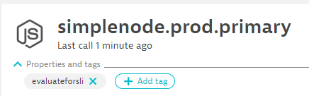
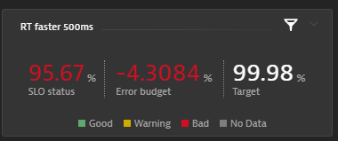

## SLI Configuration

While most users will use the dashboard approach it is important to understand how the general processing of SLIs works without dashboards. Dashboards give an additional convenience as the `sli.yaml` file doesn't need to be created or maintained by anybody as this information is extracted from a Dynatrace Dashboard. However - in very mature organizations the approach of using SLI & SLO YAML files instead of Dynatrace Dashboards is very likely.

That is why - lets give you some basic understanding of how SLIs work with the *dynatrace-service*.

The default SLI queries that come with the *dynatrace-service* are defined as follows and will be used in case you have not specified a custom `sli.yaml` or a Dynatrace dashboard:

```yaml
spec_version: "1.0"
indicators:
 throughput: "metricSelector=builtin:service.requestCount.total:merge(\"dt.entity.service\"):sum&entitySelector=tag(keptn_project:$PROJECT),tag(keptn_stage:$STAGE),tag(keptn_service:$SERVICE),tag(keptn_deployment:$DEPLOYMENT),type(SERVICE)"
 error_rate: "metricSelector=builtin:service.errors.total.rate:merge(\"dt.entity.service\"):avg&entitySelector=tag(keptn_project:$PROJECT),tag(keptn_stage:$STAGE),tag(keptn_service:$SERVICE),tag(keptn_deployment:$DEPLOYMENT),type(SERVICE)"
 response_time_p50: "metricSelector=builtin:service.response.time:merge(\"dt.entity.service\"):percentile(50)&entitySelector=tag(keptn_project:$PROJECT),tag(keptn_stage:$STAGE),tag(keptn_service:$SERVICE),tag(keptn_deployment:$DEPLOYMENT),type(SERVICE)"
 response_time_p90: "metricSelector=builtin:service.response.time:merge(\"dt.entity.service\"):percentile(90)&entitySelector=tag(keptn_project:$PROJECT),tag(keptn_stage:$STAGE),tag(keptn_service:$SERVICE),tag(keptn_deployment:$DEPLOYMENT),type(SERVICE)"
 response_time_p95: "metricSelector=builtin:service.response.time:merge(\"dt.entity.service\"):percentile(95)&entitySelector=tag(keptn_project:$PROJECT),tag(keptn_stage:$STAGE),tag(keptn_service:$SERVICE),tag(keptn_deployment:$DEPLOYMENT),type(SERVICE)"
```

**Note:** The default SLI queries require the following tags on the services and within the query:

* `keptn_project`
* `keptn_stage`
* `keptn_service`
* `keptn_deployment`

When Keptn queries these SLIs for e.g. the service `carts` in the stage `dev` within project `sockshop`, it would translate to the following tags in the query:

* `keptn_project:sockshop`
* `keptn_stage:dev`
* `keptn_service:carts`
* `keptn_deployment:primary` (or `keptn_deployment:canary` during tests)

If you use Keptn for the deployment of your artifacts using Keptn's Helm Service you will have these four tags automatically set and detected by Dynatrace. If you want to use other tags, you need to overwrite the SLI configuration (see below).

### Overwrite SLI Configuration / Custom SLI queries

Users can override the predefined queries, as well as add custom queries by creating a SLI configuration: 

* A custom SLI configuration is a YAML file as shown below:

    ```yaml
    ---
    spec_version: "1.0"
    indicators:
      your_metric: "metricSelector=your_metric:count&entitySelector=tag(keptn_project:$PROJECT),tag(keptn_stage:$STAGE),tag(keptn_service:$SERVICE),tag(keptn_deployment:$DEPLOYMENT),type(SERVICE)"
    ```

* To store this configuration, you need to add this file to Keptn's configuration store either on project, stage, or service level. The remote `resourceUri` needs to be `dynatrace/sli.yaml`. This is done by using the Keptn CLI with the [keptn add-resource](https://keptn.sh/docs/0.8.x/reference/cli/commands/keptn_add-resource/) command:

    ```console
    keptn add-resource --project=yourproject --stage=yourstage --service=yourservice --resource=./sli.yaml --resourceUri=dynatrace/sli.yaml
    ```

### More examples on custom SLIs

You can define your `sli.yaml` that defines ANY type of metric available in Dynatrace - on ANY entity type (APPLICATION, SERVICE, PROCESS GROUP, HOST, CUSTOM DEVICE, etc.). You can either "hard-code" the queries in your `sli.yaml` or you can use placeholders such as $SERVICE, $STAGE, $PROJECT, $DEPLOYMENT as well as $LABEL.yourlabel1, $LABEL.yourlabel2. This is very powerful as you can define generic `sli.yaml` files and leverage the dynamic data of a Keptn event.

Here is an example where we are retrieving the tag name from a label that is passed to Keptn:

```yaml
indicators:
    throughput:  "metricSelector=builtin:service.requestCount.total:merge(\"dt.entity.service\"):sum&entitySelector=tag($LABEL.dttag),type(SERVICE)"
```

So, if you are sending an event to Keptn and passing in a label with the name `dttag` and a value e.g. `evaluateforsli` then it will match a Dynatrace service that has this tag on it:



You can also have SLIs that span multiple layers of your stack, e.g. services, process groups and host metrics. Here is an example that queries one metric from a service, one from a process group and one from a host. The tag names come from labels that are sent to Keptn:

```yaml
indicators:
    throughput:  "metricSelector=builtin:service.requestCount.total:merge(\"dt.entity.service\"):sum&entitySelector=tag($LABEL.dtservicetag),type(SERVICE)"
    gcheapuse:   "metricSelector=builtin:tech.nodejs.v8heap.gcHeapUsed:merge(\"dt.entity.process_group_instance\"):sum&entitySelector=tag($LABEL.dtpgtag),type(PROCESS_GROUP_INSTANCE)"
    hostmemory:  "metricSelector=builtin:host.mem.usage:merge(\"dt.entity.host\"):avg&entitySelector=tag($LABEL.dthosttag),type(HOST)"
```

Hopefully these examples help you see what is possible. If you want to explore more about Dynatrace Metrics, and the queries you need to create to extract them I suggest you explore the Dynatrace API Explorer (Swagger UI) as well as the [Metric API v2](https://www.dynatrace.com/support/help/extend-dynatrace/dynatrace-api/environment-api/metric-v2/) documentation.

### Advanced SLI Queries for Dynatrace

Here are a couple of additional query options that have been added to the Dynatrace SLI Service over time to extend the capabilities of querying more relevant data:

**Dynatrace SLO Definition**

With Dynatrace Version 207, Dynatrace introduced native support for SLO monitoring. The *dynatrace-service* is able to query these SLO definitions by referencing them by SLO-ID. Here is such an SLO as seen in a dashboard:



And here is the corresponding SLI query which is specified as `SLO;<SLOID>`:

```yaml
indicators:
    rt_faster_500ms: SLO;524ca177-849b-3e8c-8175-42b93fbc33c5
```

The *dynatrace-service* basically queries the SLO using the `/api/v2/slo/<sloid>` endpoint and will return evaluatedPercentage field!

**Open Problems**
One interesting metric is the number of open problems you may have in a particular environment or those that match a particular problem type. Dynatrace provides the Problem APIv2 which allows you to query problems by `entitySelector` as well as `problemSelector`. You can pass both fields as part of an SLI query prefixing it with `PV2`. Here is an example on how such an SLI definition would look like:

```yaml
indicators:
    problems: PV2;problemSelector=status(open)&entitySelector=managementZoneIds(7030365576649815430)
```

The *dynatrace-service* will return the totalCount field of the `/api/v2/problems` endpoint passing your query string!

**Define Metric Unit for Metrics Query**

Most SLIs you define are queried using the Metrics API v2. The following is an example from above:

```yaml
indicators:
 teststep_rt_Basic_Check: "metricSelector=calc:service.teststepresponsetime:merge(\"dt.entity.service\"):avg:names:filter(eq(\"Test Step\",\"Basic Check\"))&entitySelector=type(SERVICE)"
```

When the *dynatrace-service* executes this query it simply returns the value of that metric. What is not always known is the metric unit. Depending on the metric definition this could be nanoseconds, microseconds, milliseconds or seconds or even bytes, kilobytes or megabytes.

For `builtin:service.response.time` metrics the *dynatrace-service* converts the result from **MicroSecond**s into **MilliSecond**s automatically. For other metrics however, you need to let the *dynatrace-service* know about the expected *Metric Unit*. You can prefix your regular query with `MV2;<MetricUnit>;` which would give you `MV2;<MetricUnit>;<Regular Query>`. So - the above example can be changed to this to tell the service that this metric's unit is **MicroSecond**s and will therefore be converted into **MilliSecond**s:

```yaml
indicators:
 teststep_rt_Basic_Check: "MV2;MicroSecond;metricSelector=calc:service.teststepresponsetime:merge(\"dt.entity.service\"):avg:names:filter(eq(\"Test Step\",\"Basic Check\"))&entitySelector=type(SERVICE)"
```

The possible metric units are those that Dynatrace specifies in the API. Please have a look at the Metric API documentation for a complete overview.

**Please note:**

Currently the *dynatrace-service* only does the following conversions before returning the value to Keptn. While this does not yet solve each request we have seen from our users this solves many use cases of users asking for better handling of **MicroSecond**s and **Byte**s:

| Source Data Type | Converted To |
|:----------------|:-----------------|
| MicroSecond | MilliSecond |
| Byte | KiloByte |

In other words currently there are only two possible prefixes for your regular query:
* either `MV2;MicroSecond;`
* or `MV2;Byte;`
* everything else e.g. `MV2;Percent;`, `MV2;` or `MV2;;` would fail and return an error

If you want to have a more flexible way to convert metric units please let us know by creating an issue and explaining your use case.