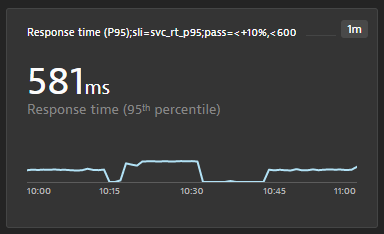
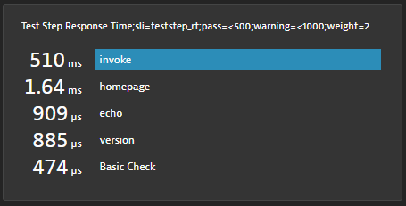
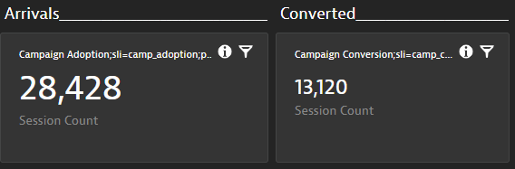

## SLIs & SLOs via Dynatrace Dashboard

Based on user feedback we learned that defining custom SLIs via the `sli.yaml` and then defining SLOs via `slo.yaml` can be challenging as one has to be familiar with the Dynatrace Metrics v2 API to craft the necessary SLI queries.

As dashboards are a prominent feature in Dynatrace to visualize metrics, it was a logical step to leverage dashboards as the basis for Keptn's SLI/SLO configuration.

If *dynatrace-service* parses your dashboard, it will generate an `sli.yaml` and `slo.yaml` and uploads it to your Keptn configuration repository. You can find these files on service level under `dynatrace/sli.yaml` and `slo.yaml`.

### How dynatrace-service locates a Dashboard

As explained earlier, the *dynatrace-service* gives you two options through the `dashboard` property in your `dynatrace.conf.yaml`

1. Query option: `dashboard: query`. This will query for a dashboard with the name pattern like this: `KQG;project=<YOURKEPTNPROJECT>;service=<YOURKEPTNSERVICE>;stage=<YOURKEPTNSTAGE>`

2. UUID option: use e.g: `dashboard: e6c947f2-4c29-483c-a065-269b3707bea4` which will then query exactly that dashboard via its ID

For more details refer to the section above where we explained `dynatrace.conf.yaml`

### SLI/SLO Dashboard Layout and how it generates SLI & SLO definitions

Here is a sample dashboard for our simplenode sample application:


Here is how the individual pieces matter:

**1. Name of the dashboard**

If the dashboard is not referenced in `dynatrace.conf.yaml` via the Dashboard ID and you specified `query`, the *dynatrace-service* queries all dashboards and uses the one that starts with `KQG;` followed by the name-value pairs:

```
project=<project>,service=<service>,stage=<stage>
```

The order of these name-value pairs is not relevant, but the values have to match your Keptn project, service and stage. In the example dashboard you see that this dashboard matches the project *simpleproject*, service *simplenode*, and stage *staging*.

**2. Management Zone Filter**

If you are building a dashboard specific to an application or part of your environment, it is a good practice to set a default management zone filter for your dashboard. The *dynatrace-service* will use that filter. This can either be a custom created management zone or - like in the example above - the one that Keptn creates in case you use Keptn for the deployment.

**3. Markdown with SLO Definitions**

The dashboard is not only used to define which metrics should be evaluated (list of SLIs), it is also used to define the individual SLOs and global settings for the SLO, e.g., *Total Score* goals or *Comparison Rules*. These are settings you normally have in your `slo.yaml`.
To specify those settings simply create a markdown that contains name-value pairs like in the example dashboard.

Here is the text from that markup you see in the screenshot:
```
KQG.Total.Pass=90%;KQG.Total.Warning=75%;KQG.Compare.WithScore=pass;KQG.Compare.Results=1;KQG.Compare.Function=avg
```

It is not mandatory to define them as there are defaults for all of them. Here is a table that gives you the details on each setting:

| Setting | Default | Comment |
|:------|:-------|:-------|
| KQG.Total.Pass | 90% | Specifies total pass goal of your SLO |
| KQG.Total.Warning | 75% | Specifies total warning goal of your SLO |
| KQG.Compare.Result | 1 | Against how many previous builds to compare your result to? |
| KQG.Compare.WithScore | pass | Which previous builds to include in the comparison: pass, pass_or_warn or all |
| KQG.Compare.Function | avg | When comparing against multiple builds which aggregation should be used: avg, p50, p90, p95 |


**4. Tiles with SLI definition**

The *dynatrace-service* analyzes every tile but only includes those in the SLI/SLO analysis where the tile name includes the name-value pair: `sli=sliprefix`

If you look at the example dashboard screenshot, you see some tiles that have the `sli=sliprefix` and some that don't. This allows you to build dashboards that you can extend with metrics that should not be included in your SLI/SLO validation.

Similar to the markdown, each tile can define several configuration elements. The only mandatory is sli=sliprefix.
Here a couple of examples of possible values. It actually starts with a human readable value that is not included in the analysis but makes the dashboard more readable:

```
Test Step Response Time;sli=teststep_rt;pass=<500;warning=<1000;weight=2
Process Memory;sli=process_memory
Response time (P50);sli=svc_rt_p95;pass=<+10%,<500
```

| Setting | Sample Value | Comment |
|:------|:-------|:-------|
| sli | test_rt | This will become the SLI Name, e.g: test_Rt If the chart includes metrics split by dimensions - then the value is a prefix and each dimension will be appended, e.g: test_rt_teststep1, test_rt_teststep2 |
| pass | <500,<+10% | This can be a comma-separated list which allows you to specify multiple criteria as you can also do in the `slo.yaml`. You are also allowed to specify multiple pass name/value pairs which will result into multiple criteria just as allowed in the `slo.yaml` spec |
| warning | <1000 | Same as with pass |
| weight | 1 | Allows you to define a weight of the SLI. Default is 1 |
| key | true | If true, this SLI becomes a key SLI. Default is false |

**5. Tile examples**

Here a couple of examples from tiles and how they translate into `sli.yaml` and `slo.yaml` definitions

*1: Service Response Time (p95)*

 

* Results in an `sli.yaml` like this:

    ```yaml
    svc_rt_p95: metricSelector=builtin:service.response.time:percentile(50):names&entitySelector=type(SERVICE),mzId(-8783122447839702114)
    ```

* And an `slo.yaml` definition like this:

    ```yaml
    - sli: svc_rt_p95
      pass:
        - criteria
            - "<+10%"
              "<600"
      weight 1
      key_sli: false
    ```


*2: Test Step Response Time*

 

* Result in an SLI definition like this

    ```yaml
    teststep_rt_Basic_Check: "metricSelector=calc:service.teststepresponsetime:merge(\"dt.entity.service\"):avg:names:filter(eq(\"Test Step\",\"Basic Check\"))&entitySelector=type(SERVICE),mzId(-8783122447839702114)",
    teststep_rt_echo: "metricSelector=calc:service.teststepresponsetime:merge(\"dt.entity.service\"):avg:names:filter(eq(\"Test Step\",echo))&entitySelector=type(SERVICE),mzId(-8783122447839702114)",
    teststep_rt_homepage: "metricSelector=calc:service.teststepresponsetime:merge(\"dt.entity.service\"):avg:names:filter(eq(\"Test Step\",homepage))&entitySelector=type(SERVICE),mzId(-8783122447839702114)",
    teststep_rt_invoke: "metricSelector=calc:service.teststepresponsetime:merge(\"dt.entity.service\"):avg:names:filter(eq(\"Test Step\",invoke))&entitySelector=type(SERVICE),mzId(-8783122447839702114)",
    teststep_rt_version: "metricSelector=calc:service.teststepresponsetime:merge(\"dt.entity.service\"):avg:names:filter(eq(\"Test Step\",version))&entitySelector=type(SERVICE),mzId(-8783122447839702114)",
    ```

* And an SLO like this:
    ```yaml
        - sli: teststep_rt_invoke
          pass:
            - criteria
                - "<500"
          warning:
            - criteria
                - "<1000"
          weight 2
          key_sli: false
        - sli: teststep_rt_version
          pass:
            - criteria
                - "<500"
          warning:
            - criteria
                - "<1000"
          weight 2
          key_sli: false      
          ...
    ```

### Support for SLO Tiles

SLOs in Dynatrace are a new feature to monitor SLOs in production and report on status and error budget. As explained above the *dynatrace-service* already provides support for querying the SLO and returning the `evaluatedPercentage` field. All you need to do is add the SLO tile on your dashboard and it will be included. The *dynatrace-service* will not only return the value but also use the warning and pass criteria defined in the SLO definition for the `slo.yaml` for Keptn:


### Support for Problem Tiles

A great use case is to validate whether there are any open problems in a given environment as part of your Keptn Quality Gate Evaluation. As described above the *dynatrace-service* supports querying the number of problems that have a certain status using Dynatrace's Problem API v2.
To include the open problem count that matches your dashboards management zone you can simply add the "Problems" tile to your dashboard. If this tile is on the dashboard you will get an SLI with the name `problems`, the value will be the total count of problems open. The default SLO will be that `problems` is a `key sli` with a pass criteria of `<=0`. This results in the following `slo.yaml` entry being generated:

```yaml
objectives:
- sli: problem_open
  pass:
  - criteria:
    - <=0
  key_sli: true
```

### Support for USQL Tiles

The *dynatrace-service* also supports Dynatrace USQL tiles. The query will be executed as defined in the dashboard for the given timeframe of the SLI evaluation.

There are just some things to know for the different USQL result types:

|Tile Type| Comment |
|:-------|:---------|
| Single | Just a single value |
| Pie Chart | Takes dimension name and value |
| Column Chart | First columns is considered dimension and second is the value |
| Table | First column is considered dimension and last column the value |
| Funnel | Currently not supported |

Here is an example with two USQL Tiles showing a single value of a query:



This will translate into two SLIs called `camp_adoption` and `camp_conv`. The SLO definition is the same as explained above with regular time series. 

### Steps to set up a Keptn project for SLI/SLO Dashboards

This should work with any existing Keptn project you have. Just make sure you have the *dynatrace-service* enabled for your project. 
Then create a dashboard as explained above that the *dynatrace-service* can match to your project/service/stage. 

**Until Keptn 0.7.2**
If you start from scratch and you have never run an evaluation in your project make sure you upload an empty `slo.yaml` to your service. Why? Because otherwise the Lighthouse service will skip evaluation and never triggers the *dynatrace-service*. This is just a one time initialization effort.

Here is an empty `slo.yaml` you can use:

```yaml
---
spec_version: '0.1.0'
comparison:
objectives:
```

Also check out the samples folder of this repo with some additional helper files and the exported dashboard from the example above.