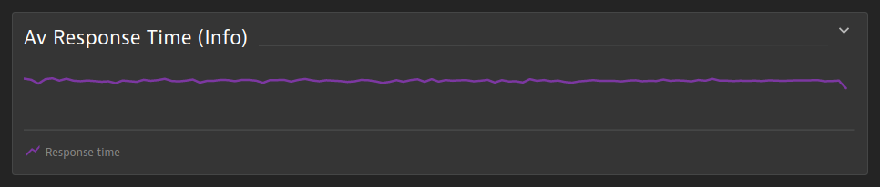
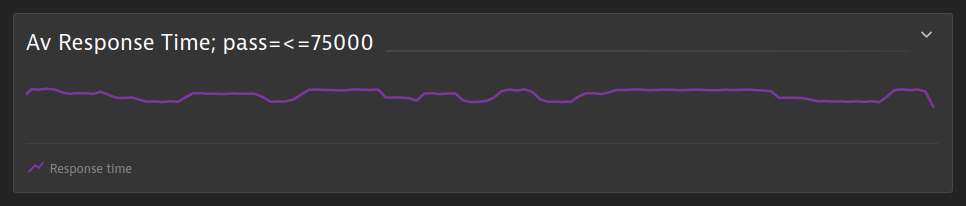
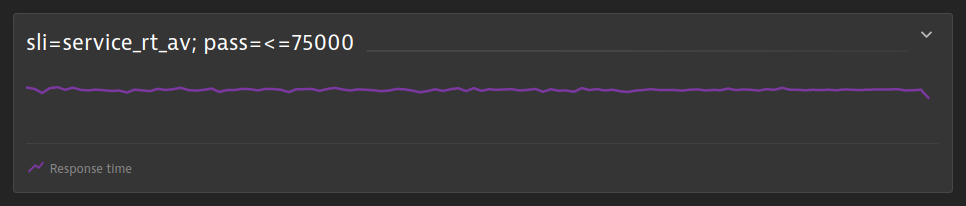
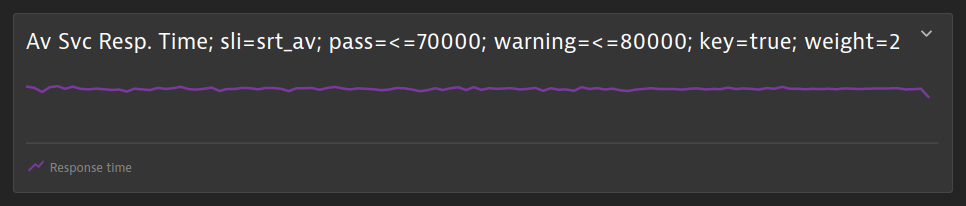
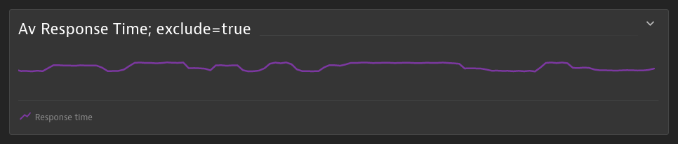
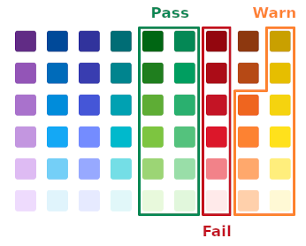
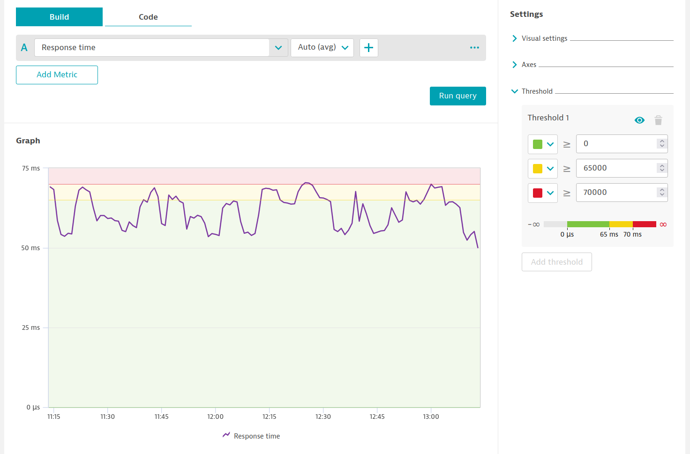
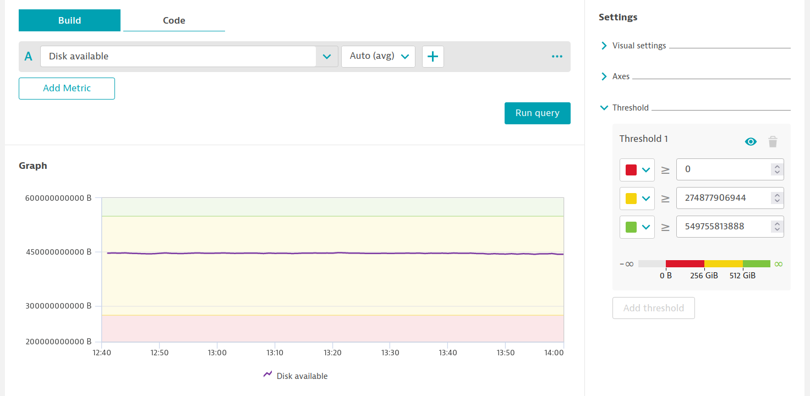
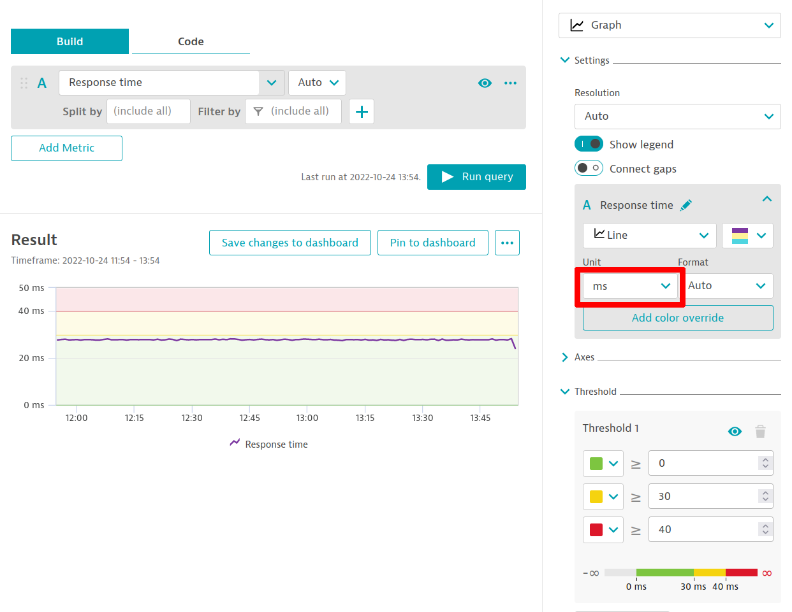

# SLIs and SLOs based on a Dynatrace dashboard

The dynatrace-service can dynamically create SLIs and SLOs from a Dynatrace dashboard in response to a `sh.keptn.event.get-sli.triggered` event. To select this mode, set the `dashboard` property in the `dynatrace/dynatrace.conf.yaml` configuration file. Two options are available:

- `query`: the dynatrace-service will use the first dashboard found with a name beginning with `KQG;project=<project>;service=<service>;stage=<stage>`, where `<project>`, `<service>` and `<stage>` are taken from the `sh.keptn.event.get-sli.triggered` event. To further customize the name, append any additional description as `;<custom-description>` after the stage.
- `<dashboard-uuid>`: set the `dashboard` property to the UUID of a specific dashboard to use it.

In response to  a `sh.keptn.event.get-sli.triggered` event, the dynatrace-service will transform each supported tile into Dynatrace API queries. An SLI is created for each result together with a corresponding SLO. The SLOs are then stored in an `slo.yaml` file in the appropriate service and stage of the Keptn project, and values of the SLIs are queried and returned in the `sh.keptn.event.get-sli.finished` event.


## Defining SLIs and SLOs

By default, the tile's title is taken as the display name of the SLO. A clean version of this name (lower case, with spaces, `/`,  `%`, `$` and `.` replaced with `_`) is used as the base-name of the associated SLI. The properties of the SLO can be further customized by appending `;`-separated `<key>=<value>` pairs to the tile's title. The following keys are supported:

| Key | Description | Example |
|---|---|---|
| `sli` | Use `<value>` as the base-name of the SLI | `sli=response_time` |
| `pass` | Add `<value>` as a pass criterion to the SLO | `pass=<200` |
| `warning` | Add `<value>` as a warning criterion to the SLO | `warning=<300` |
| `key` | Mark SLI as a key SLI | `key=true` |
| `weight` | Set the weight of the SLO to `<value>` | `weight=2` |
| `exclude` | Set to `true` to exclude this tile | `exclude=true` |

Consult [the Keptn documentation](https://keptn.sh/docs/0.16.x/reference/files/slo/#objectives) for more details on configuring objectives.

**Note:**
In case dynatrace-service could not parse the tile title correctly it will stop the processing of this tile and return an error for the concerned SLI.

### Examples
* **Informational SLO**
  
  To retrieve the value of an SLI purely for informational purposes, giving the tile a title is sufficient. As it does not include a pass criterion it will not be included in an evaluation. For example, the title `Av Response Time (Info)`

  

  results in an SLO objective:

  ```{yaml}
  - sli: av_response_time_(info)
    displayName: Av Response Time (Info)
    pass: []
    warning: []
    weight: 1
    key_sli: false
  ```

* **Display name and pass criterion**
  
  To include an SLO as part of an evaluation, simply append a pass criterion. For example, the title `Av Response Time; pass=<=75000`

  

  results in an SLO objective:

  ```{yaml}
  - sli: av_response_time
    displayName: Av Response Time
    pass:
      - criteria:
          - <=75000
    warning: []
    weight: 1
    key_sli: false
  ```

* **SLI name and pass criterion**
  
  Alternatively, create an SLO by providing an SLI name and a pass criterion. For example, the title `sli=service_rt_av; pass=<=75000`

  

  results in an SLO objective:

  ```{yaml}
  - sli: service_rt_av
    displayName: service_rt_av
    pass:
      - criteria:
          - <=75000
    warning: []
    weight: 1
    key_sli: false
  ```

* **Custom SLI name with pass and warning criteria**

  The SLI name as well as the properties of the SLO may be customized. For example, the title `Av Svc Resp. Time; sli=srt_av; pass=<=70000; warning=<=80000; key=true; weight=2`

  

  results in an SLO objective:

  ```{yaml}
  - sli: srt_av
    displayName: Av Svc Resp. Time
    pass:
      - criteria:
          - <=70000
    warning:
      - criteria:
          - <=80000
    weight: 2
    key_sli: true
  ```

* **Excluded tile**

  To exclude a tile, simply add the key-value pair `exclude=true`. For example, the title `Av Response Time; exclude=true`

  

  will ensure that the tile is not processed.

### Logical AND/OR operators for pass and warning criteria

The Keptn SLO objective definition for `pass` and `warning` criteria allows logical **AND** as well as **OR** operators.

In order to achieve a logical **AND** operator like this
```{yaml}
pass:
  - criteria:
    - "<=+10%"
    - "<600"
```
you would need to separate the criteria values with a comma. E.g. `sli=some-name;pass=<+10%,<600`.

For logical **OR** operators like
```{yaml}
 pass:
  - criteria:
    - "<=+10%"
  - criteria:
    - "<600"
```
you need to include the `pass` (or `warning`) key multiple times in the title. E.g. `sli=some-name;pass=<+10%;pass=<600`.

Of course, you can also have a combination of both

```{yaml}
pass:
  - criteria:
    - "<=+10%"
    - "<600"
  - criteria:
    - "<500"
```
E.g. `sli=some-name;pass=<+10%,<600;pass=<500`


## Supported tile types

**Note**:
As dashboards currently do not offer a tile for *security problems*, the only way to create SLIs based thereon is by using [file-based SLIs](slis-via-files.md#open-security-problems-prefix-secpv2).

The following dashboard tile types are supported:


### Data Explorer tiles

Data Explorer tiles may be configured using either the Build or Code tab. In both cases tiles must only include a single query, i.e., one metric, which is limited to a maximum of 100 metric series results. If a tile does produce more than one metric series, a separate SLO is created for each with the dimension values being appended to the SLO name.

To make it easy to define SLOs using Data Explorer tiles, pass and warning criteria as well as units and resolution may be specified directly in the UI using the tile properties.

#### Pass warning criteria

Pass and warn criteria can be specified by adding visual thresholds directly to the tile rather than using pass and warn criteria in the tile's title. If thresholds and pass and warn criteria have been specified, the thresholds will be ignored.

Pass-warn-fail and fail-warn-pass configurations are supported. In both cases, three thresholds must be added using strictly monotonically increasing values and colors from the pre-defined color palette:



**Example: pass-warn-fail thresholds applied to the `builtin:service.response.time` metric**



This configuration produces the following SLO criteria:

```{yaml}
pass:
  - criteria:
    - ">=0"
    - "<650000"
warning:
  - criteria:
    - ">=0"
    - "<70000"
```

**Example: fail-warn-pass thresholds applied to the `builtin:host.disk.avail` metric**



This configuration produces the following SLO criteria:

```{yaml}
pass:
  - criteria:
    - ">=549755813888"    
warning:
  - criteria:
    - ">=274877906944"    
```

#### Customizing units

To create SLOs with an alternate unit, select it in the visualization configuration of the query in the tile. The thresholds or pass and warning criteria must be defined in the same units. For example, to create a SLO for service response time in milliseconds, configure the tile as follows:



#### Specifying resolution

The resolution of the data queried from the Metrics v2 API may be set using the Resolution setting of the tile. In all cases, the dynatrace-service will attempt to obtain a single value by setting `resolution=Inf` if possible or applying a `:fold()` transformation. An error is produced if multiple values are still returned, in this instance please modify the query, e.g. using the Code tab of the Data Explorer.

### Custom chart tiles

Each custom chart tile may only contain a single series. Furthermore, the series may only contain zero or one *dimensions* and optionally a single *filter*.


### Problems tiles

A problems tile on the dashboard is mapped to an SLI `problems` with the total count of open problems. A corresponding SLO specifies that `problems` is a key SLI with a pass criterion of `<=0`.


### SLO tiles

An SLO tile will produce an SLI with the same name as the underlying SLO and the SLO status (or `evaluatedPercentage`) as the value. The SLO's pass and warning criteria are taken directly from the target and warning thresholds of the underlying SLO. Querying remote environments, or using custom management zones or timeframes is not supported.    


### USQL tiles

Depending on the query and visualization type, a USQL tile will produce one or more SLIs. Single value queries always produce a single SLI, whereas bar charts, line charts, pie charts and tables produce an SLI (and SLO) for each value of the selected dimension. The funnel visualization type is currently not supported.


## Automatic expansion of results including one or more dimensions

Results from queries created from Data Explorer, Custom Charting or USQL tiles that include one or more dimensions are automatically expanded into multiple SLIs and SLOs. In this case the SLI name specified in the tile's title is used as base and dimension values are concatenated to it to produce unique names.

For example, a Data Explorer query titled `sli=response_time;pass=<20` targeting the metric `builtin:service.response.time` and split by `dt.entity.service` that returns values for `journey service` and `account service` will result in an SLI `response_time_journey_service` and `response_time_account_service`.


## SLO Comparison and Scoring

By default, the dynatrace-service instructs Keptn to perform the evaluation of SLOs using the following comparison and scoring properties:

```yaml
comparison:
  compare_with: "single_result"
  number_of_comparison_results: 1
  include_result_with_score: "pass"
  aggregate_function: avg
total_score:
  pass: 90%
  warning: 75%
```

Further details about SLO comparison and scoring are provided in [the Keptn documentation](https://keptn.sh/docs/0.16.x/reference/files/slo/).

To override these defaults, add a markdown tile to the dashboard consisting of a single line with one or more of the following `;`-separated `<key>=<value>` pairs:

| Key                     | Data type (restriction)                | Description                                                                                                                                          |
|-------------------------|----------------------------------------|------------------------------------------------------------------------------------------------------------------------------------------------------|
| `KQG.Compare.Results`   | number (`> 0`)                         | Use `<value>` as the `comparison: number_of_comparison_results` value. `comparison: compare_with` will be set automatically according to this value. |
| `KQG.Compare.WithScore` | string (`pass`, `all`, `pass_or_warn`) | Use `<value>` as the `comparison: include_result_with_score` value                                                                                   |
| `KQG.Compare.Function`  | string (`avg`, `p50`, `p90`, `p95`)    | Use `<value>` as the `comparison: aggregate_function` value                                                                                          |
| `KQG.Total.Pass`        | number (with optional `%`)             | Use `<value>` as the `total_score: pass` value                                                                                                       |
| `KQG.Total.Warning`     | number (with optional `%`)             | Use `<value>` as the `total_score: warning` value                                                                                                    |

For example, the defaults above could be specified using the following markdown tile:

```
KQG.Total.Pass=90%;KQG.Total.Warning=75%;KQG.Compare.WithScore=pass;KQG.Compare.Results=1;KQG.Compare.Function=avg
```


## Limiting the scope of SLIs using management zones

The entities used for SLIs may be filtered either by setting a management zone for the entire dashboard or for individual tiles. In case both are specified, the management zone applied to a tile is used.
