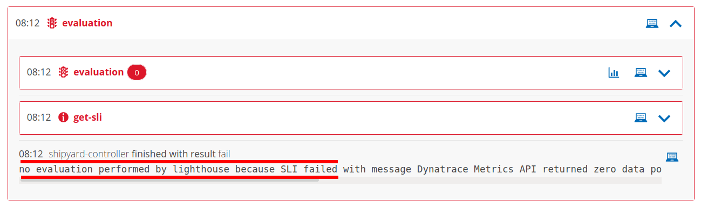
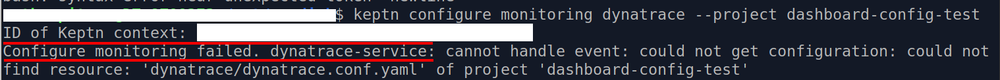
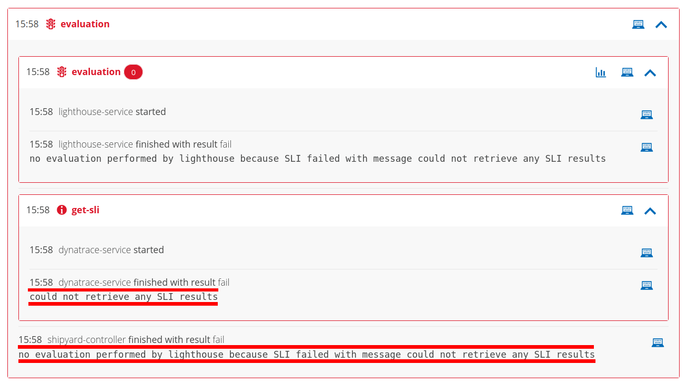
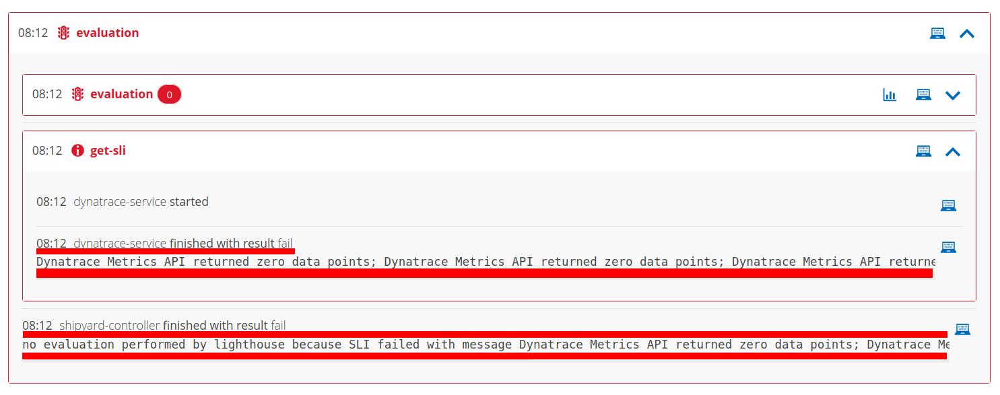
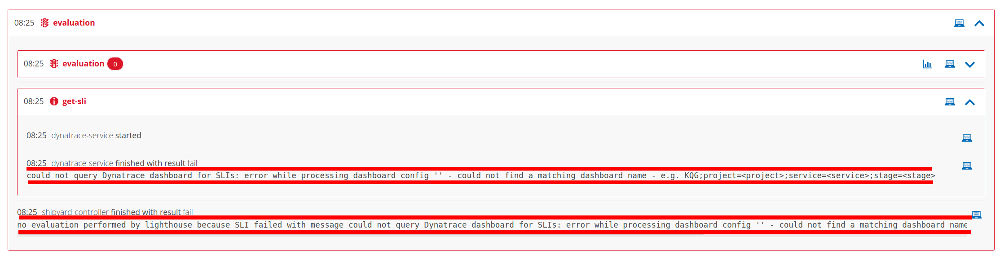
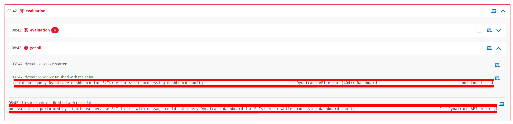

# Troubleshooting common problems
The following subsections outline the solutions to some common problems that may occur when first setting up a Keptn project to use the dynatrace-service.

## Evaluation succeeds, but no evaluation was performed

Evaluation succeeds but the shipyard-controller reports:
> `no evaluation performed by lighthouse because no SLI-provider configured for project dashboard-config-test`

### Likely cause
- An evaluation was triggered but Keptn is not configured to use Dynatrace as the monitoring provider

### Suggested solution
- Run `keptn configure monitoring dynatrace --project <project-name>` to configure Dynatrace as the monitoring provider

## Configure monitoring fails

Keptn CLI reports:
> `Configure monitoring failed. dynatrace-service: cannot handle event: could not get configuration: could not find resource: 'dynatrace/dynatrace.conf.yaml' of project 'dashboard-config-test'`

### Likely cause
- The CLI command `keptn configure monitoring dynatrace --project <project-name>` was run before adding a `dynatrace/dynatrace.conf.yaml` to the Keptn project

### Suggested solution
- Create a `dynatrace/dynatrace.conf.yaml` file on the project level. See [Configuring the dynatrace-service with `dynatrace/dynatrace.conf.yaml`](dynatrace-conf-yaml-file.md).
- Following this, re-run `keptn configure monitoring dynatrace --project <project-name>`

## Could not retrieve any SLI results

Evaluation fails but the shipyard-controller reports:
> `could not retrieve any SLI results`

### Likely cause
- SLIs and SLOs should be defined using YAML files but no SLOs have been defined i.e. no `slo.yaml` file can be found

### Suggested solution
- If SLIs and SLOs should be defined using YAML files, define SLOs by creating a `slo.yaml` file, or
- If SLIs and SLOs should be sourced from a dashboard, add a `dashboard` entry to the `dynatrace/dynatrace.conf.yaml` configuration file

## Dynatrace Metrics API returned zero data points

Evaluation fails and the shipyard-controller reports:
> `no evaluation performed by lighthouse because SLI failed with message Dynatrace Metrics API returned zero data points...`

### Likely cause
- No data is available during the evaluation timeframe

### Suggested action
- Check the availability of data for the evaluation timeframe, e.g. using the Data Explorer in the Dynatrace tenant

## Could not query Dynatrace dashboard for SLIs: ...could not find a matching dashboard name

Evaluation fails and the shipyard-controller reports:
> `could not query Dynatrace dashboard for SLIs: error while processing dashboard config '' - could not find a matching dashboard name - e.g. KQG;project=<project>;service=<service>;stage=<stage>`

### Likely cause
- Dynatrace-service is configured to query a dashboard for SLIs (i.e. `dynatrace/dynatrace.conf.yaml` contains `dashboard: query`) but no dashboard named with the pattern `KQG;project=<project>;service=<service>;stage=<stage>` is available

### Suggested actions
- If SLIs and SLOs should be sourced from a dashboard, create a dashboard named with the pattern `KQG;project=<project>;service=<service>;stage=<stage>` in the Dynatrace tenant, or
- If SLIs and SLOs should be defined using YAML files, remove the `dashboard: query` entry from `dynatrace/dynatrace.conf.yaml`

## Could not query Dynatrace dashboard for SLIs: ...Dashboard "..." not found

Evaluation fails and the shipyard-controller reports:
> `could not query Dynatrace dashboard for SLIs: error while processing dashboard config '12345678-1234-1234-1234-12345678abcd' - Dynatrace API error (404): Dashboard 12345678-1234-1234-1234-12345678abcd not found`

### Likely cause
- Dynatrace-service is configured to query a specific dashboard for SLIs (i.e. `dynatrace/dynatrace.conf.yaml` contains `dashboard: <dashboard-id>`) but no dashboard with the specified ID is available

### Suggested actions
- If SLIs and SLOs should be sourced from a dashboard, ensure `dynatrace/dynatrace.conf.yaml` contains a `dashboard: <dashboard-id>` entry with the correct dashboard ID, or
- If SLIs and SLOs should be defined using YAML files, remove the `dashboard: <dashboard-id>` entry from `dynatrace/dynatrace.conf.yaml`
