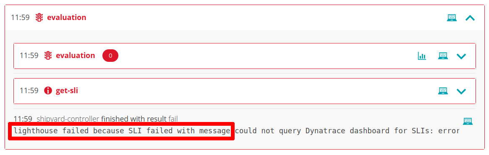

# Evaluation fails

## Lighthouse failed because

Evaluation fails and the shipyard-controller reports:
> `lighthouse failed because...`

In this case the Lighthouse performed no evaluation because the received `sh.keptn.event.get-sli.finished` event had a `result` of `fail`. The root cause can be identified from the `message` field of this event.

In instances where this is related to a specific SLI, check the `message` field of the individual SLI result in the within `indicatorValues`. This can be viewed in Keptn UI by expanding the `sh.keptn.event.get-sli.finished` event and viewing its payload:

The following subsections detail some common messages as well as likely causes and solutions:

### Message: `could not query Dynatrace dashboard for SLIs: error while processing dashboard config '12345678-1234-1234-1234-12345678abcd': Dynatrace API error (404): Dashboard 12345678-1234-1234-1234-12345678abcd not found`

**Likely cause**

- Dynatrace-service is configured to query a specific dashboard for SLIs (i.e. [`dynatrace/dynatrace.conf.yaml` contains `dashboard: <dashboard-id>`](dynatrace-conf-yaml-file.md#dashboard-sli-mode-configuration-dashboard)) but no dashboard with the specified ID is available

**Suggested solution**

 - If SLIs and SLOs should be sourced from a dashboard, ensure `dynatrace/dynatrace.conf.yaml` contains a `dashboard: <dashboard-id>` entry with the correct dashboard ID, or
 - If SLIs and SLOs should be defined using YAML files, remove the `dashboard: <dashboard-id>` entry from `dynatrace/dynatrace.conf.yaml`

### Message: `could not query Dynatrace dashboard for SLIs: error while processing dashboard config '': no dashboard name matches the name specification...`

**Likely cause**

- Dynatrace-service is configured to query a dashboard for SLIs (i.e. `dynatrace/dynatrace.conf.yaml` contains `dashboard: query`) but no dashboard named with the pattern `KQG;project=<project>;service=<service>;stage=<stage>` is available

**Suggested solution**

- If SLIs and SLOs should be sourced from a dashboard, create a dashboard named with the pattern `KQG;project=<project>;service=<service>;stage=<stage>` in the Dynatrace tenant, or
- If SLIs and SLOs should be defined using YAML files, remove the [`dashboard: query` entry from `dynatrace/dynatrace.conf.yaml`](dynatrace-conf-yaml-file.md#dashboard-sli-mode-configuration-dashboard)
