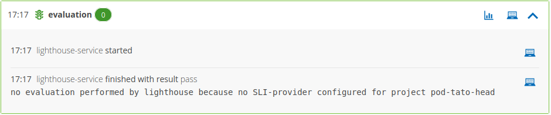

# Evaluation succeeds but no evaluation was performed

Evaluation succeeds but the shipyard-controller reports:
> `no evaluation performed by lighthouse because no SLI-provider configured for project ...`

Likely cause:
- An evaluation was triggered but Keptn is not configured to use Dynatrace as the monitoring provider

Suggested solution:
- Run `keptn configure monitoring dynatrace --project <project-name>` to configure Dynatrace as the monitoring provider
