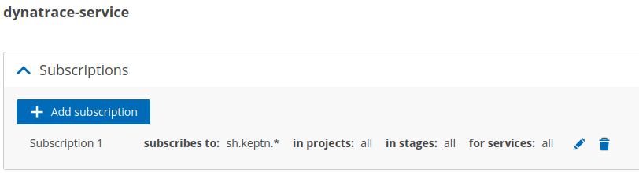

# Restore Keptn wildcard subscriptions

By default, dynatrace-service subscribes to `sh.keptn.*` - so basically all `sh.keptn` events.



If you have changed this via Keptn Uniform and want to go back to the default of `sh.keptn.*` then you can do the following to achieve this.

In the future Keptn might introduce a way to restore the default via Keptn Uniform UI.

## Using Keptn API

### Get all subscriptions from Keptn for dynatrace-service

Go to Keptn API / controlPlane and query `GET /uniform/registration`  endpoint with parameter `name=dynatrace-service`. This should return a payload like the one below:

```json
[
  {
    "id": "4b4d28a8f3bf811aa735f9531bae6bebf0df0f78",
    "name": "dynatrace-service",
    "metadata": {
      "hostname": "<some hostname>",
      "integrationversion": "0.20.0",
      "distributorversion": "0.9.0",
      "location": "control-plane",
      "kubernetesmetadata": {
        "namespace": "<some namespace>",
        "podname": "dynatrace-service-f645c8db5-bg4rr",
        "deploymentname": "dynatrace-service"
      },
      "lastseen": "2022-01-18T12:00:43.744Z"
    },
    "subscription": {
      "topics": null,
      "status": "",
      "filter": {
        "project": "",
        "stage": "",
        "service": ""
      }
    },
    "subscriptions": null
  }
]
```

Find the service with the correct version (if there are more than one) and copy the **integrationID** - in this case it would be `4b4d28a8f3bf811aa735f9531bae6bebf0df0f78` for version `0.20.0`

Here we clearly see that there are no subscriptions available (`subscriptions: null`), because they were deleted before.

### Optional: Query the available subscriptions for that integration

In case you see at least one subscription, then you can query them via `GET /uniform/registration/{integrationID}/subscription` with the correct **integrationID**  from last step.

This should then return the subscription(s) you might have set up via Keptn Uniform like:

```json
[
  {
    "id": "6ea2d86e-d6fa-4b52-a487-28cf4e4b2161",
    "event": "sh.keptn.event.get-sli.triggered",
    "filter": {
      "projects": [],
      "stages": [],
      "services": []
    }
  }
]
```


### Optional: Delete the current resp. invalid subscription

If you do have an invalid subscription, then delete it by `DELETE /uniform/registration/{integrationID}/subscription/{subscriptionID}` and use the correct **integrationID**  from above, as well as the correct **subscriptionID** from the last step


### Add a new default subscription

If you want to reset the dynatrace-service to use its default subscription then you need to `POST /uniform/registration/{integrationID}/subscription` using the correct **integrationID** from above and payload below:

```json
{
  "filter": {
      "projects": [],
      "stages": [],
      "services": []
  },
  "event": "sh.keptn.>"
}
```
